# Autonomous EHS Management System

[](https://github.com/SafetyMP/Autonomous-EHS-Management/actions/workflows/ci.yml)
[](https://github.com/SafetyMP/Autonomous-EHS-Management/actions/workflows/codeql-analysis.yml)
[](LICENSE)
[](https://github.com/SafetyMP/Autonomous-EHS-Management/releases)

**Autonomous compliance operations platform** — give your team one place to log what happened, assign fixes, and prove the follow-up.

<p align="center">
  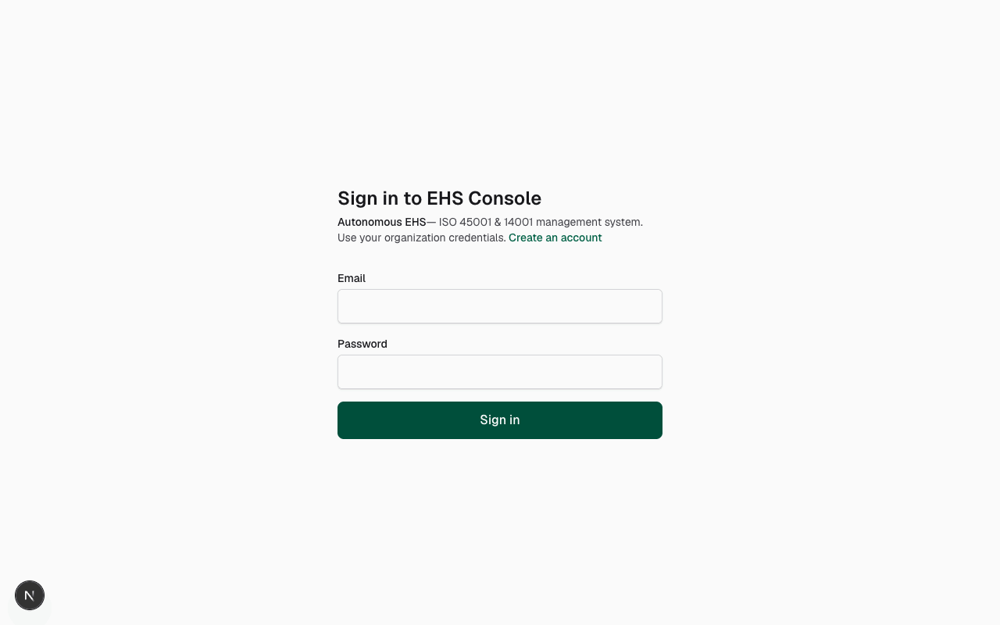
</p>

## Screenshots

| Command center | Incidents | CAPA register |
|----------------|-----------|---------------|
| 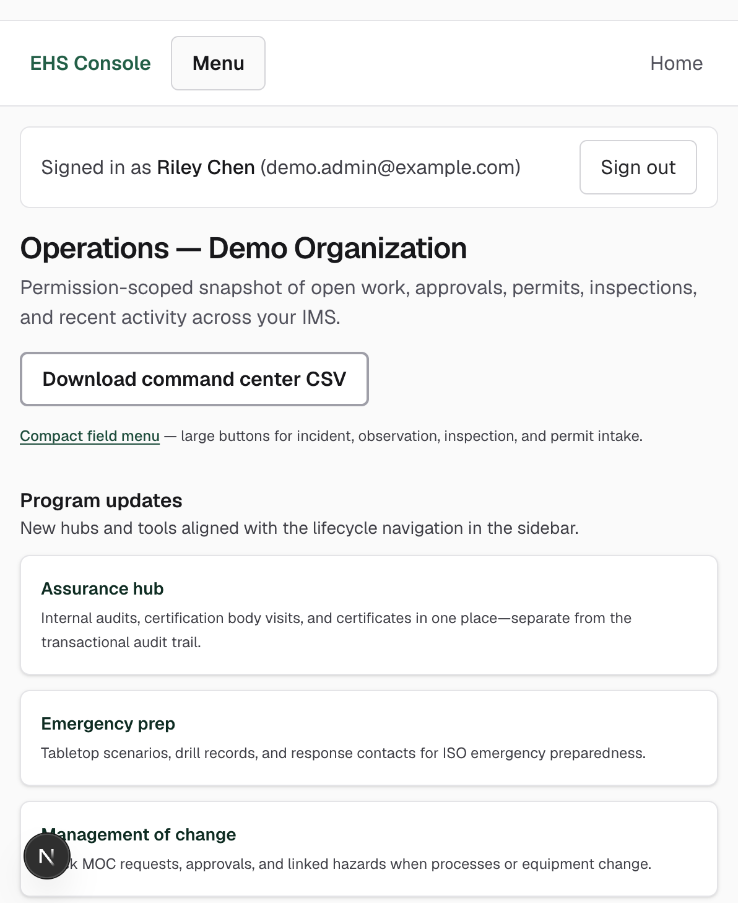 | 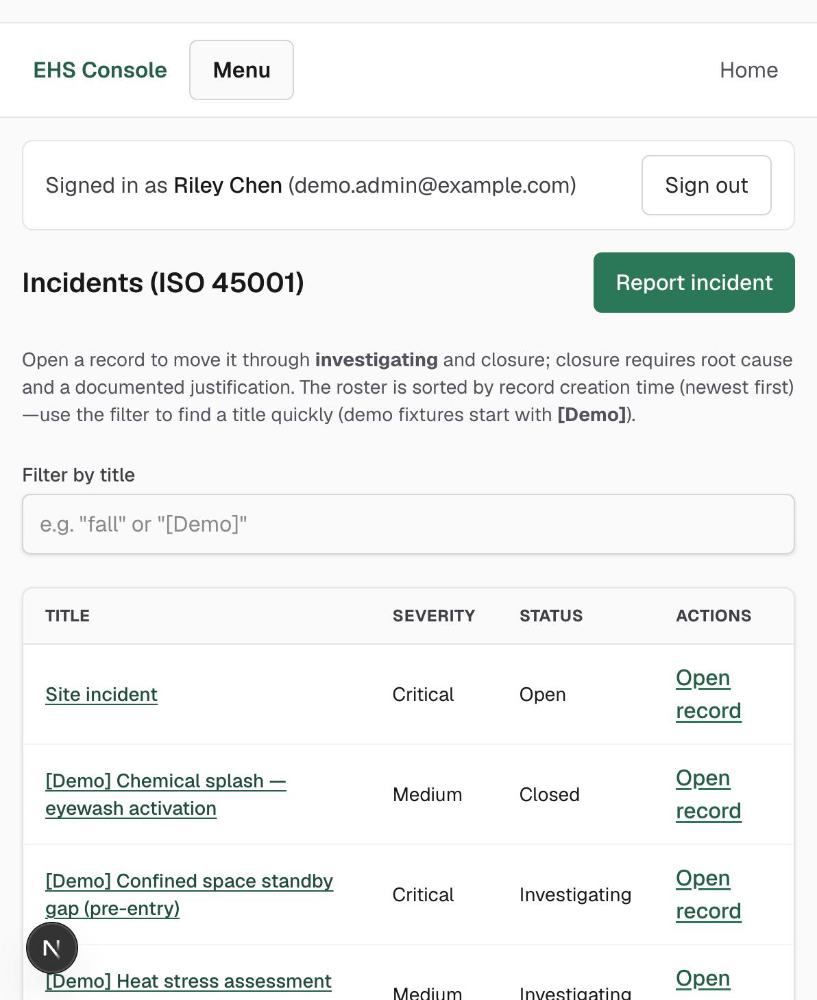 | 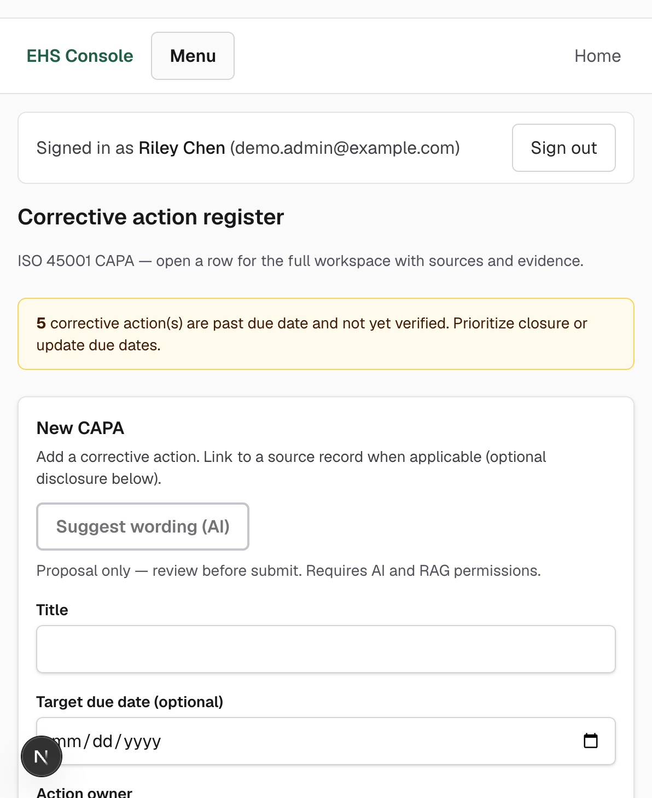 |

| Approvals | Tasks & reviews | Inspections |
|-----------|-----------------|-------------|
| 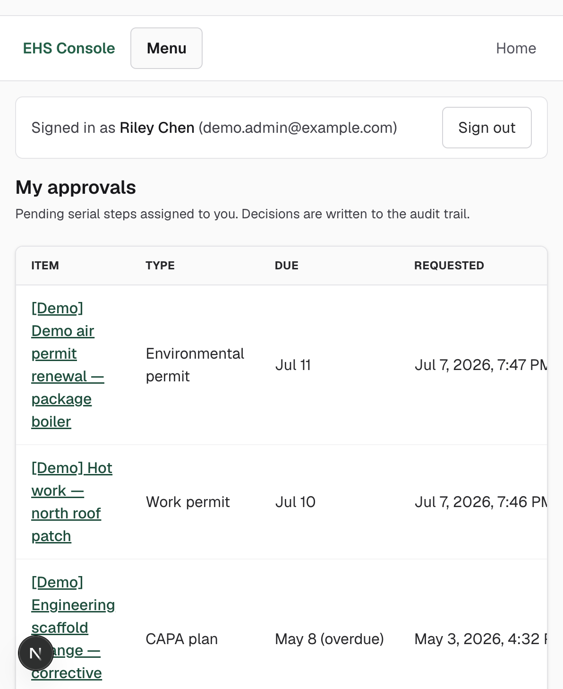 | 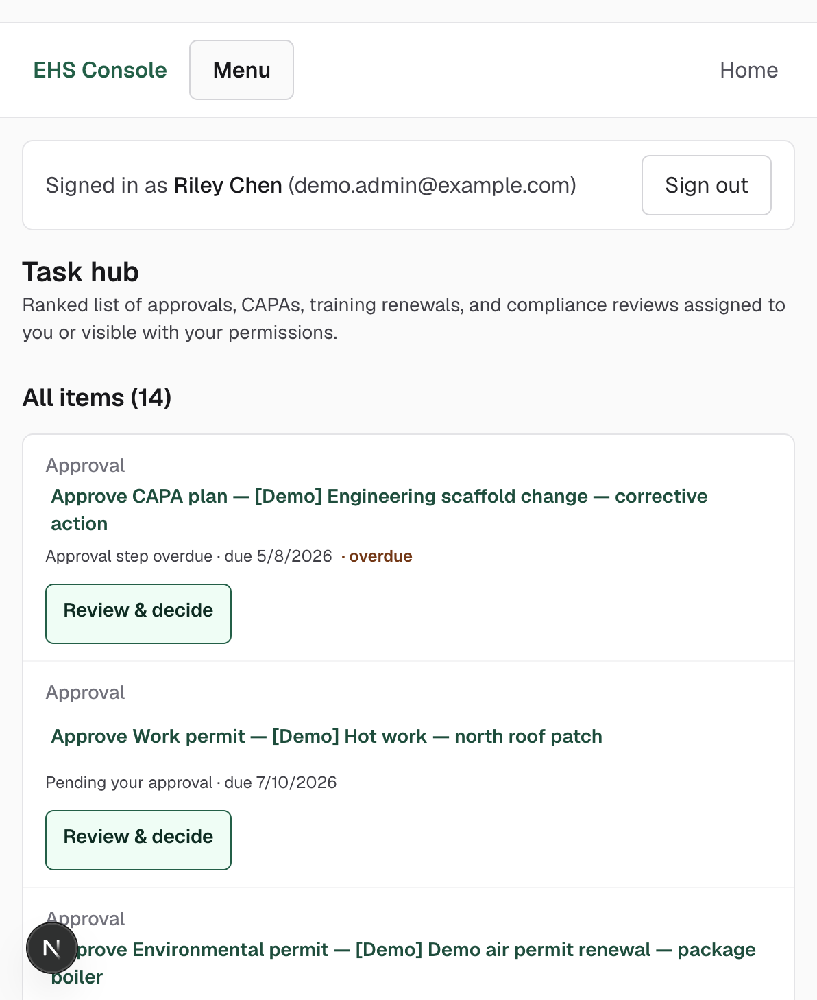 | 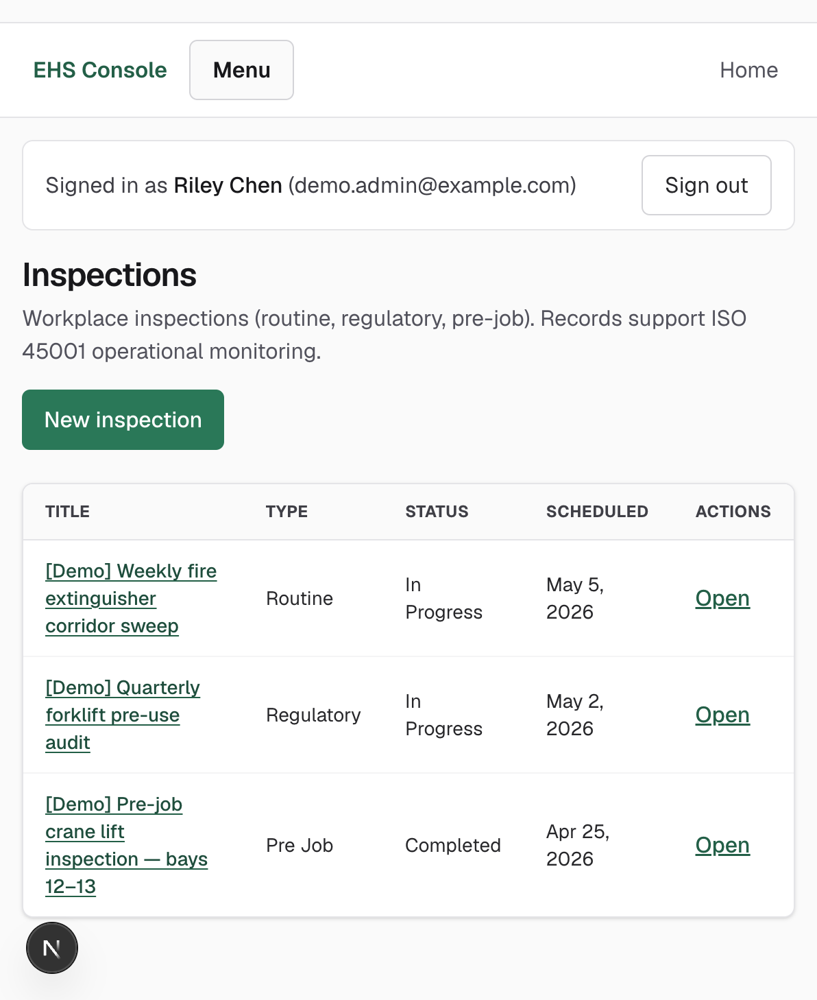 |

| Metrics | Audit trail | Observations | Work permits |
|---------|-------------|--------------|--------------|
| 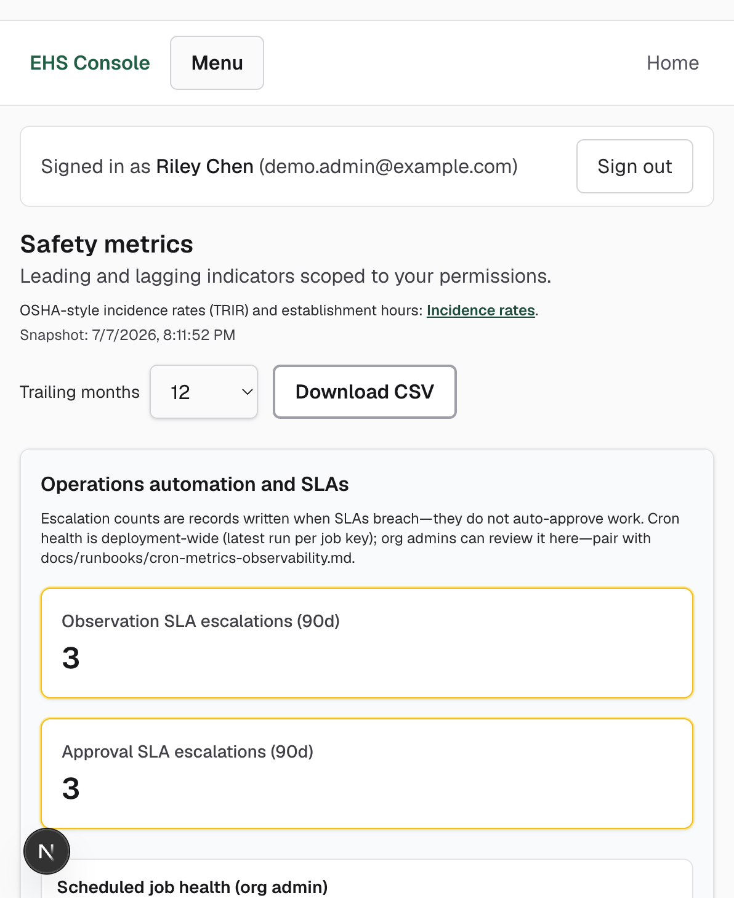 | 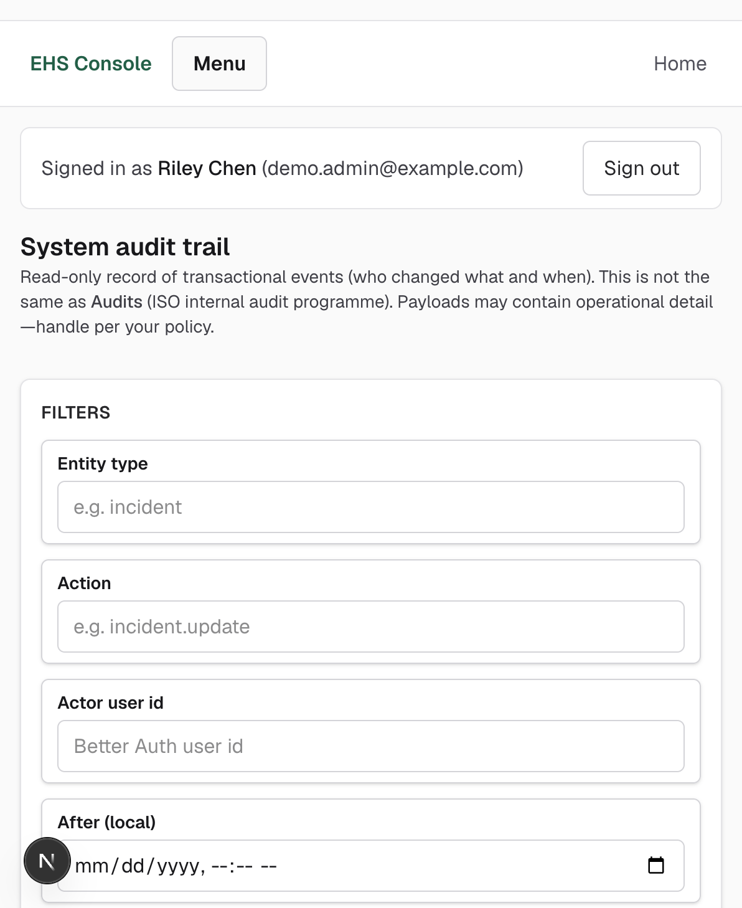 | 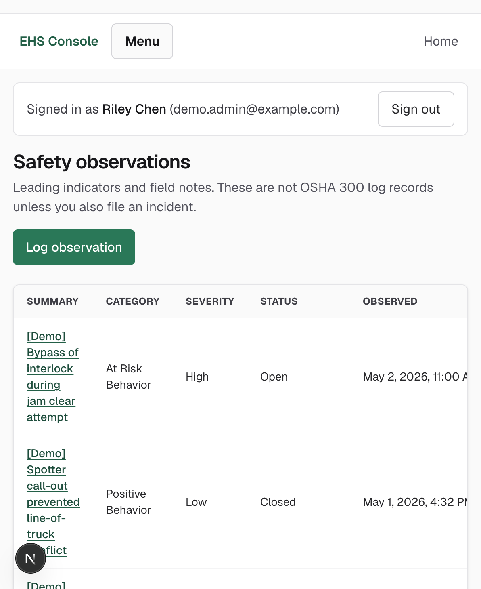 | 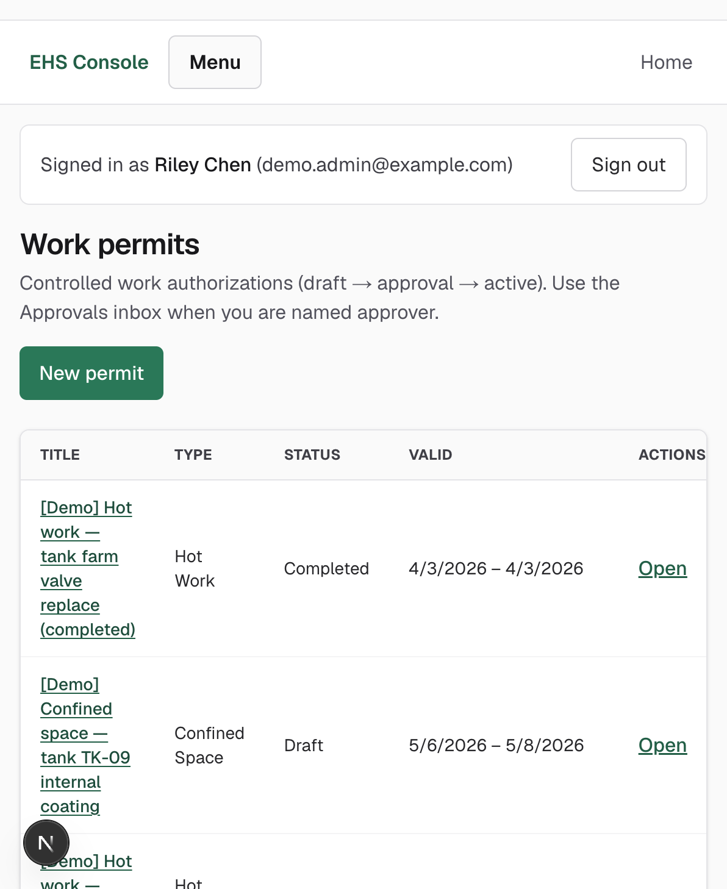 |

- **Live demo:** [autonomous-ehs-management.vercel.app](https://autonomous-ehs-management.vercel.app) — or run locally in ~5 minutes ([Turnkey local demo](#turnkey-local-demo-docker-postgres))
- **License:** [Apache 2.0](LICENSE) · **Docs:** [docs/README.md](docs/README.md) · **Contribute:** [CONTRIBUTING.md](CONTRIBUTING.md)
- **OSS health:** [OpenSSF badge setup](REPO_SETUP.md#10-oss-health-badges--social-preview) · social preview source in [`docs/assets/github-social-preview.png`](docs/assets/github-social-preview.png)

## Contents

- [Quick start](#quick-start)
- [Environment snapshots](#environment-snapshots)
- [Turnkey local demo (Docker Postgres)](#turnkey-local-demo-docker-postgres)
- [GitHub Codespaces / Dev Container](#github-codespaces--dev-container)
- [Non-demo development](#non-demo-development-existing-flow)
- [Architecture (high level)](#architecture-high-level)
- [Deploy](#deploy)
- [What “autonomous” means here](#what-autonomous-means-here)
- [Who this is for](#who-this-is-for)
- [Open source, maintained for the long term](#open-source-maintained-for-the-long-term)
- [Operators and integrations (self-host)](#operators-and-integrations-self-host)
- [Enterprise SSO (OIDC pilot)](#enterprise-sso-oidc-pilot)
- [License](#license)

## Quick start

1. **Clone and install:** `git clone <repo-url> && cd <repo-dir> && npm ci`  
   **Path tip:** Avoid a **working directory name with a trailing space** (some macOS / archive flows introduce `"…System "`). That can break scripts, tooling, and shell `cd` unless you always **quote paths**—prefer renaming the folder to remove stray spaces.
2. **Configure:** pick a row in **Environment snapshots** below and copy the listed template to `.env.local` (fill secrets).
3. **Run:**
   - **Docker demo:** `npm run demo:up` then `npm run dev` → [http://localhost:3000/sign-in](http://localhost:3000/sign-in) (details in [Turnkey local demo](#turnkey-local-demo-docker-postgres)).
   - **Your own Postgres:** `npm run db:migrate` then `SEED_ADMIN_EMAIL=you@company.com npm run db:seed` then `npm run dev`.
4. **Before a PR:** `npm run verify` — same bar as CI ([AGENTS.md](AGENTS.md)).

## Environment snapshots

| Profile | Start from | Required / typical |
|--------|------------|-------------------|
| **Local demo (Docker)** | [`.env.demo.example`](.env.demo.example) | `DATABASE_URL` on host **port 5433**, `DATABASE_USE_PG=1`, `BETTER_AUTH_SECRET` (32+ chars), `BETTER_AUTH_URL` / `NEXT_PUBLIC_APP_URL`, demo mode + admin credentials — **never enable demo flags in production.** |
| **Local / hosted Postgres** | [`.env.example`](.env.example) | `DATABASE_URL`, `BETTER_AUTH_SECRET`, URLs; omit `DATABASE_USE_PG` when using Neon serverless; optional OIDC, `CRON_SECRET`, AI gateway, Upstash — see file comments. |
| **CI (GitHub Actions / Vitest)** | [`.env.ci`](.env.ci) | Fixture `DATABASE_URL` + `DATABASE_USE_PG=1`, synthetic secrets; **not for real deployments.** |

Optional **proposal-only AI** (when enabled) suggests intake wording or retrieves policy excerpts—it does **not** auto-submit incidents, approve CAPAs, or change regulated status. See [docs/ai-governed-intake.md](docs/ai-governed-intake.md).

**Architecture & diligence:** [docs/README.md](docs/README.md) (full documentation index), [docs/architecture-map.md](docs/architecture-map.md) (system map), [docs/workflow-depth.md](docs/workflow-depth.md) (state machines + audit patterns), [docs/procurement-readiness.md](docs/procurement-readiness.md) (ROI / pilot / positioning workbook), [docs/approval-workflow.md](docs/approval-workflow.md) (CAPA approval gate), [docs/case-studies/pilot-template.md](docs/case-studies/pilot-template.md), [docs/module-maturity.md](docs/module-maturity.md) (feature maturity), [docs/operational-webhooks.md](docs/operational-webhooks.md) (outbound event delivery), [docs/roadmap/hris-portco-integration-playbook.md](docs/roadmap/hris-portco-integration-playbook.md) (SCIM / HRIS identity), [docs/roadmap/action-queue-dashboard-spec.md](docs/roadmap/action-queue-dashboard-spec.md) (unified **Your work** queue), [docs/codebase-layout.md](docs/codebase-layout.md) (`src/` directory guide).

**Console navigation:** field steps and routes in [`docs/user-manual-ehs-console.md`](docs/user-manual-ehs-console.md), including **Records & metrics → Incidence rates** (TRIR-style analytics) and the **Your work** action queue on command center / task hub. The **authoritative sidebar structure** in code is [`src/lib/dashboard-nav-links.ts`](src/lib/dashboard-nav-links.ts) (`DASHBOARD_NAV_SECTIONS`).

**Contributors & agents:** [AGENTS.md](AGENTS.md) (verify / CI), [GOVERNANCE.md](GOVERNANCE.md) (evergreen OSS), [docs/README.md](docs/README.md) (documentation index), [docs/codebase-layout.md](docs/codebase-layout.md) (`src/` map), [CONTRIBUTING.md](CONTRIBUTING.md), [SECURITY.md](SECURITY.md), [CONTEXT.md](CONTEXT.md) (architecture), [COMPLIANCE.md](COMPLIANCE.md) (regulatory / data governance).

---

## Turnkey local demo (Docker Postgres)

**Goal:** Postgres + migrations + realistic demo data + optional “Try demo admin” on sign-in.

### 1. Start the database

```bash
docker compose -f docker-compose.demo.yml up -d
```

Wait until Postgres is healthy (`pg_isready`).

The compose file maps the database to **host port `5433`** so it does not fight with a local Postgres that already listens on `5432`. Your `DATABASE_URL` must use that port (see `.env.demo.example`).

### 2. Environment

```bash
cp .env.demo.example .env.local
```

Edit `.env.local` if needed. Important:

- **`DATABASE_USE_PG=1`** when using the compose Postgres URL (uses the `pg` pool instead of the Neon serverless driver).
- **`BETTER_AUTH_SECRET`**: at least 32 characters (use a random value outside committed examples).
- **`DEMO_MODE=true`** and **`NEXT_PUBLIC_DEMO_MODE=1`** to enable server-side demo sign-in and the sign-in CTA.
- **`DEMO_ADMIN_EMAIL`** / **`DEMO_ADMIN_PASSWORD`**: credentials created by the demo seed (must match what you intend to use).

**Security:** Never set `DEMO_MODE` on production. If demo secrets leak, rotate them.

### 3. Install, migrate, seed, run

**One command (after `.env.local` exists):** brings up compose, waits for Postgres, migrates, and seeds:

```bash
npm ci
npm run demo:up
npm run dev
```

**Or step-by-step:**

```bash
npm ci
npm run db:migrate
npm run db:seed:demo
npm run dev
```

`npm run db:migrate` runs [`scripts/migrate.ts`](scripts/migrate.ts) so database errors are printed clearly (wrapper around Drizzle’s migrator).

**Demo data after upgrades:** `npm run db:seed:demo` is **idempotent per domain**—re-run it to **backfill** new fixtures (observations, permits, inspections, approvals, environment, contractors, privacy DSAR sample, program CB audit/certificate, etc.) without wiping the org. For a **clean slate** on the throwaway **Demo Organization**, use the reset script below.

**Evaluator-oriented fixtures** (idempotent `[Demo]` scope): **environmental regulatory permits** (conditions, monitoring link, one pending with approval inbox), **incident RCA** (5 Whys + Ishikawa on seeded incidents; showcase bow-tie/chronology where applicable), **risk** register with overdue review + a **task-based** assessment and **steps**, **Command Center** onboarding checklist rows marked complete when prerequisites exist, **program automation** samples (`escalation_event`), **integrations** backlog (**failed** `integration_event`, disabled operational webhook + connector mapping JSON), **RAG** (`rag_source` + `rag_chunk` without embeddings — list/detail friendly), **obligation ↔ RAG** link on the stormwater obligation, and an **evidence attachment** registry row with a **non-fetchable** placeholder URI. **Context Sync** artifacts are **not** seeded. The **workflow catalog** under `/dashboard/workflow-catalog` is **code-derived** ([`src/lib/workflow/catalog.ts`](src/lib/workflow/catalog.ts)), not database fixtures.

**Cron telemetry note:** seed can insert **synthetic `cron_job_run`** rows for `reminders` and `data-retention` when there is no successful run in the last 7 days — the table is **deployment-global** (not org-scoped). Use only on **throwaway** demo databases; set **`DEMO_SEED_CRON_RUNS=0`** in `.env.local` to skip, or keep shared staging operator telemetry untouched.

Open [http://localhost:3000/sign-in](http://localhost:3000/sign-in). Use **Try demo admin** (when enabled) or sign in with the demo email and password from `.env.local`.

**Health check:** [http://localhost:3000/api/health](http://localhost:3000/api/health) returns JSON `{ ok, database }` after the app can reach Postgres.

### Browse-only sandbox

Set **`DEMO_READ_ONLY=true`** (with **`DEMO_MODE=true`**). All **tRPC mutations** return `FORBIDDEN`; reads still work so stakeholders can explore safely.

### Reset demo organization (clean slate)

```bash
npm run db:seed:demo:reset
```

Clears **`[Demo]`-prefixed** rows for **Demo Organization** across field operations, demo-scoped **approval requests** (CAPA, **work permit**, and **environmental regulatory permit** pipelines), **escalation_event** backlog for that org, **integration** rows with `demo.*` event types, demo **RAG** sources/chunks + obligation evidence links, **evidence attachments** with demo filenames or placeholder URIs, **operational_webhook_endpoint** at the synthetic `example.invalid` URL, **integration_connector_mapping** rows flagged `demoFixture`, **risk_assessment_step** + assessments, environment (**regulatory permits**, conditions, obligation-linked monitoring cleared before aspects/obligations), planning, program (including KPI, CB audit, certificate), contractors, a **synthetic DSAR** privacy row, OSHA sidecar sample, incidents, CAPA, training, controlled documents, and internal audits—then runs `db:seed:demo` again. **Does not** delete global **`cron_job_run`**. Use only on throwaway demo DBs.

### Incremental refresh (keep existing demo rows)

```bash
npm run db:seed:demo
```

Skips domains that already have demo data and fills in anything missing (for example after pulling new dashboard features).

### Troubleshooting

| Issue | What to try |
|--------|------------|
| **`role "ehs" does not exist` on port 5432** | Your host `5432` is another Postgres. Use **`DATABASE_URL` … `@127.0.0.1:5433`** with the demo compose file (published as **5433**). |
| **Migration errors / duplicate index** | Use a **fresh volume**: `docker compose -f docker-compose.demo.yml down -v`, then `up -d`, then `npm run db:migrate`. |
| **`DEMO_MODE` on Vercel production** | Not supported: **`VERCEL_ENV=production`** fails startup if `DEMO_MODE=true` (see [`src/instrumentation.ts`](src/instrumentation.ts)). |
| **Playwright demo login** | Set **`PLAYWRIGHT_DEMO=1`**, run **`npm run demo:up`** and **`npm run dev`** with demo `.env.local`, then `npx playwright test tests/e2e/demo` (includes optional **fixture richness** checks against seeded RCA, env permits, risk steps, and integration DLQ). |
| **CSV import (`/dashboard/import`)** | Paste CSV with header row. **Environmental aspects:** `name,activity,description` then e.g. `Stormwater sampling,Monitoring,"Quarterly outfall tests"`. **Hazards:** `title,description` then e.g. `Forklift traffic,"Blind corners near loading bay"`. |

### Optional: richer narratives during seed

If **`OPENAI_API_KEY`** (and optional **`OPENAI_BASE_URL`**) are set when you run `db:seed:demo`, incident and CAPA text is lightly rewritten for variety. Without a key, deterministic copy is used (CI-friendly).

---

## GitHub Codespaces / Dev Container

The repo includes [`.devcontainer/devcontainer.json`](.devcontainer/devcontainer.json) with Postgres (pgvector) + a **Node 22** dev container. Reopen the project in the container; **`postCreateCommand`** runs `npm ci`, `db:migrate`, and `db:seed:demo` (set secrets like `BETTER_AUTH_SECRET` in Codespace secrets if you override the compose defaults).

---

## Non-demo development (existing flow)

1. Point **`DATABASE_URL`** at your Postgres (Neon or other).
2. Do **not** set `DATABASE_USE_PG` (or set `DATABASE_USE_PG=0`) when using the Neon serverless connection string with the default driver.
3. Set **`BETTER_AUTH_URL`** and **`NEXT_PUBLIC_APP_URL`** to your dev origin.
4. Sign up once, then link RBAC:  
   `SEED_ADMIN_EMAIL=you@company.com npm run db:seed`

Verification (same bar as CI `verify` job):

```bash
npm run verify          # eslint, tsc, vitest
npm run verify:all      # + Playwright smoke
npm run test:e2e:smoke  # smoke only
npm run screenshots     # README demo GIF (2s per frame; demo stack + dev server)
```

**Local Playwright smoke (signed-in flows):** CI always runs `@smoke` E2E against a service Postgres after **`npm run db:migrate`** and **`npm run db:seed:ci`**. On a developer machine, the same tests are **skipped** unless you set **`PLAYWRIGHT_E2E_EMAIL`** and **`PLAYWRIGHT_E2E_PASSWORD`** (see [`.env.example`](.env.example)) **and** use a migrated, seeded database. Flow coverage is listed in [AGENTS.md](AGENTS.md) (Smoke E2E table).

**PortCo staging checklist:** after configuring integrations on a pilot org, run **`npm run portco:pilot-verify`** against your database — see [docs/qa/portco-staging-pilot.md](docs/qa/portco-staging-pilot.md).

---

## Architecture (high level)

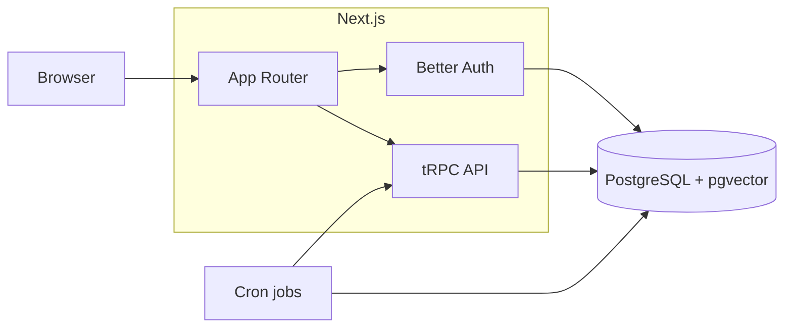

Deeper maps: [docs/architecture-map.md](docs/architecture-map.md).

| Layer | Technology |
|--------|------------|
| App & routing | **Next.js 16** (App Router), **React 19** |
| API & data fetching | **tRPC 11**, **TanStack Query** |
| Auth | **Better Auth** (email + password + optional OIDC via Generic OAuth), Drizzle adapter |
| Database | **PostgreSQL**, **Drizzle ORM**; local demo uses **`pg`** (`DATABASE_USE_PG=1`), hosted uses **Neon serverless** driver by default |
| AI / RAG | Optional **OpenAI-compatible** gateway; **pgvector** for embeddings |
| Quality | **ESLint**, **Vitest**, **Playwright** smoke E2E |

---

## Deploy

**Self-host (Docker / Kubernetes):** see **[`docs/self-host-quickstart.md`](docs/self-host-quickstart.md)** for image build, cluster rollout, cron jobs, optional pg-boss worker, and metrics scrape.

**Canonical ship path:** staging and production stay **Git authoritative** (GitHub Actions, Vercel and/or EKS) — not IDE tool connections alone. Start with **[`docs/cursor-tool-connections-deployment.md`](docs/cursor-tool-connections-deployment.md)** (promotion workflow, Vercel + Neon preview notes, secured `/api/cron/*`) and **[`REPO_SETUP.md`](REPO_SETUP.md)** (environments, secrets, optional OIDC). Implementation contracts: [`src/lib/env.ts`](src/lib/env.ts), [`vercel.ts`](vercel.ts) (platform HTTP crons), [`deploy/k8s/`](deploy/k8s/) (cluster manifests and examples). Use strong secrets, disable **all** demo flags, and run **`npm run verify`** before merge ([AGENTS.md](AGENTS.md)). Day-2 ops and runbooks: **[`.cursor/skills/devops-sre/SKILL.md`](.cursor/skills/devops-sre/SKILL.md)**.

---

## What “autonomous” means here

In this product, **autonomous** refers to **operations that keep moving without ad hoc spreadsheet chasing**: scheduled jobs (reminders, data retention, roster reconciliation, SLA checks), **recorded escalation events** when follow-ups or approvals breach deadlines, **integration failure triage** (failed inbound events with operator retry—not silent drops), durable **field outbox replay**, **integration ingest**, and **incidence-rate analytics (TRIR-style)** from IMS recordables and establishment hours—not a substitute for official OSHA filings—all with PostgreSQL as the auditable system of record. **Optional AI** suggests wording or retrieves policy context; it does **not** auto-close incidents, auto-approve CAPAs, or change regulated status without human action through normal, permission-gated workflows ([docs/ai-governed-intake.md](docs/ai-governed-intake.md), [docs/procurement-readiness.md](docs/procurement-readiness.md)).

## Who this is for

Autonomous EHS ships under **Apache 2.0** ([LICENSE](LICENSE)). You run, modify, and redistribute the software under those terms; production still needs your own ops, counsel, and compliance review ([COMPLIANCE.md](COMPLIANCE.md)).

| Adopter | Typical goal | Start here |
|---------|--------------|------------|
| **Self-host IT / platform team** | Tenant-owned Postgres, predictable infra cost, data residency in your cloud account | [Self-host quickstart](docs/self-host-quickstart.md), [open-source TCO](docs/open-source-tco.md), [Deploy](#deploy) |
| **Systems integrator (SI) / iPaaS partner** | Wire HRIS/LMS into canonical inbound envelopes without reading tRPC internals | [Integration inbound contract](docs/integration-inbound-contract.md), [connector mapping](docs/integration-connector-mapping.md) |
| **PortCo / PE portfolio pilot** | Scoped IMS pilot (incidents → CAPA → evidence, contractor wedge, HRIS identity)—not a full suite rip-and-replace | [PortCo module value](docs/portco-module-value-assessment.md), [procurement readiness](docs/procurement-readiness.md) |
| **Managed SaaS operator** | Vercel (or similar) + managed Postgres with the same application source | [Deploy](#deploy), [`.env.example`](.env.example), [`vercel.ts`](vercel.ts) |
| **Contributors & evaluators** | Local demo, tests, or patches without a sales conversation | [Quick start](#quick-start), [CONTRIBUTING.md](CONTRIBUTING.md), [AGENTS.md](AGENTS.md) |

**Open source & TCO:** [`docs/open-source-tco.md`](docs/open-source-tco.md) — license snapshot and illustrative self-host vs seat-priced inspection SaaS math.

## Open source, maintained for the long term

Autonomous EHS is an **evergreen open source project**: Apache 2.0, auditable **PostgreSQL + Drizzle** schema with migrations in-repo, and a public merge bar (`npm run verify`, same as CI). We optimize for **forkability, self-host longevity, and tenant-owned data**—not a single mandatory SaaS SKU.

| Signal | Where to look |
|--------|----------------|
| **License & economics** | [LICENSE](LICENSE), [docs/open-source-tco.md](docs/open-source-tco.md) |
| **Governance & maintainers** | [GOVERNANCE.md](GOVERNANCE.md), [`.github/CODEOWNERS`](.github/CODEOWNERS) |
| **Honest product scope** | [docs/module-maturity.md](docs/module-maturity.md) |
| **Direction & community** | [ROADMAP.md](ROADMAP.md), [CONTRIBUTING.md](CONTRIBUTING.md), [CODE_OF_CONDUCT.md](CODE_OF_CONDUCT.md) |
| **Security reporting** | [SECURITY.md](SECURITY.md) |

Production still requires **your** ops, backups, IAM, counsel, and compliance review ([COMPLIANCE.md](COMPLIANCE.md)). There is **no separate LTS branch** today—pin image digests or git SHAs and test upgrades in your environment ([GOVERNANCE.md](GOVERNANCE.md)).

---

## Operators and integrations (self-host)

These surfaces are primarily for **platform engineers**, **SRE**, and **governed tool access**—not day-to-day EHS Console menus. Operator UI for integrations, SCIM/OIDC JIT, roster drift, and failed-event triage lives at **`/dashboard/integrations`**.

| Surface | Route / API | Doc link |
|---------|-------------|----------|
| Inbound integration | `POST /api/integration/inbound` | [integration-inbound-contract.md](docs/integration-inbound-contract.md) |
| SCIM 2.0 | `/api/scim/v2/Users`, `/api/scim/v2/Groups` | [hris-portco-integration-playbook.md](docs/roadmap/hris-portco-integration-playbook.md) |
| Operational outbound webhooks | tRPC + integrations UI | [operational-webhooks.md](docs/operational-webhooks.md) |
| Context Sync (REST) | `/api/contextsync/*` | [runbooks/context-sync-provenance.md](docs/runbooks/context-sync-provenance.md) |

- **Context Sync (REST):** Session-authenticated HTTP routes under **`/api/contextsync/*`** for **Context Sync**—IMS-linked artifacts, permissions, and provenance—when the organization enables the capability. Access is rate-limited like other gated APIs; optional caps: **`CONTEXT_SYNC_ORG_DAILY_READ_LIMIT`** and **`CONTEXT_SYNC_PROVENANCE_MAX_LIMIT`** (see [`src/lib/env.ts`](src/lib/env.ts), [`.env.example`](.env.example)). Architecture: [`docs/architecture-map.md`](docs/architecture-map.md).

- **Scheduled HTTP crons:** [`vercel.ts`](vercel.ts) schedules three platform cron handlers (Bearer **`CRON_SECRET`**):

  | Route | Schedule (UTC) | Purpose |
  |-------|----------------|---------|
  | `GET /api/cron/reminders` | `0 8 * * *` | SLA reminders, escalations, operational webhook dispatch |
  | `GET /api/cron/data-retention` | `30 9 * * *` | Retention policy execution |
  | `GET /api/cron/integration-roster-reconcile` | `0 3 * * *` | Nightly HRIS roster drift for orgs with snapshots (detect + manual reconcile) |

  **`GET /api/cron/metrics`** is a separate **pull/scrape** endpoint (Prometheus or JSON)—it is **not** in the `vercel.ts` schedule; configure an external scraper or agent in Kubernetes or your observability stack. Runbook: [`docs/runbooks/cron-metrics-observability.md`](docs/runbooks/cron-metrics-observability.md).

- **Background jobs:** When **`PG_BOSS_ENABLED=true`**, enqueue paths use **pg-boss** in Postgres; run a worker process with **`npm run job:worker`** alongside the web app. Details: [`docs/JOB_QUEUE.md`](docs/JOB_QUEUE.md).

---

## Enterprise SSO (OIDC pilot)

When **`OIDC_DISCOVERY_URL`**, **`OIDC_CLIENT_ID`**, and **`OIDC_CLIENT_SECRET`** are all set (see [`src/lib/env.ts`](src/lib/env.ts)), the server registers Better Auth’s **Generic OAuth** plugin. Add to `.env.local`:

- **`OIDC_PROVIDER_ID`** — defaults to `enterprise-oidc`; must match the client button (`authClient.signIn.oauth2`).
- **`NEXT_PUBLIC_ENTERPRISE_SSO=1`** — shows **Continue with company SSO** on [`/sign-in`](http://localhost:3000/sign-in).
- **`NEXT_PUBLIC_OIDC_PROVIDER_ID`** — optional override; defaults to `enterprise-oidc`.

Register the redirect URL with your IdP: `{BETTER_AUTH_URL}/api/auth/oauth2/callback/{OIDC_PROVIDER_ID}`.

**Org linkage:** by default, first-time OIDC users still need membership/RBAC ([`scripts/seed.ts`](scripts/seed.ts) / admin invite flow). Optional **JIT**: set `OIDC_JIT_ENABLED=true`, `OIDC_JIT_DEFAULT_ORG_ID`, and optionally `OIDC_JIT_ROLE_SLUG` per [docs/OIDC_JIT_PROVISIONING.md](docs/OIDC_JIT_PROVISIONING.md) (review with IdP/counsel before production).

---

## License

Licensed under **Apache License 2.0** — see **[LICENSE](LICENSE)**. SPDX: **`Apache-2.0`** (also set in **`package.json`**).

Contributing, governance, and security: **[CONTRIBUTING.md](CONTRIBUTING.md)**, **[GOVERNANCE.md](GOVERNANCE.md)**, **[SECURITY.md](SECURITY.md)**. GitHub org setup: **[REPO_SETUP.md](REPO_SETUP.md)**.
