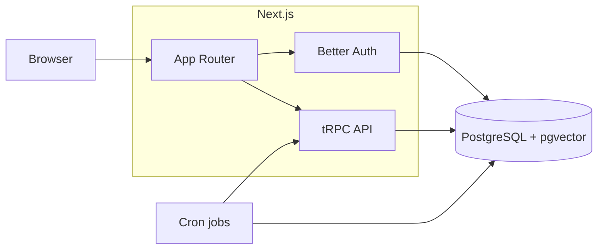

# Autonomous EHS Management System

**Autonomous compliance operations platform** — give your team one place to log what happened, assign fixes, and prove the follow-up. Autonomous EHS is a browser-based console for people who run safety programs day to day—not a pile of separate files.

**Architecture & diligence:** [docs/architecture-map.md](docs/architecture-map.md) (system map), [docs/workflow-depth.md](docs/workflow-depth.md) (state machines + audit patterns), [docs/procurement-readiness.md](docs/procurement-readiness.md) (ROI / pilot / positioning workbook), [docs/approval-workflow.md](docs/approval-workflow.md) (CAPA approval gate), [docs/case-studies/pilot-template.md](docs/case-studies/pilot-template.md).

Sign in and use the left-hand navigation to work across **Overview**, **Metrics**, **Incidents**, **CAPA**, **Contractors**, **Approvals**, **Environment**, **Documents**, **Mgmt review**, **Planning**, **Training**, **Audits**, **Context**, **Tasks**, **Program**, and **Import**. Optional assistants can draw on your approved materials when you turn that feature on.

**End-user guide:** [`docs/user-manual-ehs-console.md`](docs/user-manual-ehs-console.md) (step-by-step routes, troubleshooting, and field-friendly wording).

**Contributors & agents:** [AGENTS.md](AGENTS.md) (verify / CI), [CONTRIBUTING.md](CONTRIBUTING.md), [SECURITY.md](SECURITY.md), [CONTEXT.md](CONTEXT.md) (architecture), [COMPLIANCE.md](COMPLIANCE.md) (governance notes).

Stack, local demo, and deploy guidance for builders start under **Architecture** below.

---

## Architecture (high level)



Deeper maps: [docs/architecture-map.md](docs/architecture-map.md).

| Layer | Technology |
|--------|------------|
| App & routing | **Next.js 16** (App Router), **React 19** |
| API & data fetching | **tRPC 11**, **TanStack Query** |
| Auth | **Better Auth** (email + password + optional OIDC via Generic OAuth), Drizzle adapter |
| Database | **PostgreSQL**, **Drizzle ORM**; local demo uses **`pg`** (`DATABASE_USE_PG=1`), hosted uses **Neon serverless** driver by default |
| AI / RAG | Optional **OpenAI-compatible** gateway; **pgvector** for embeddings |
| Quality | **ESLint**, **Vitest**, **Playwright** smoke E2E |

---

## Enterprise SSO (OIDC pilot)

When **`OIDC_DISCOVERY_URL`**, **`OIDC_CLIENT_ID`**, and **`OIDC_CLIENT_SECRET`** are all set (see [`src/lib/env.ts`](src/lib/env.ts)), the server registers Better Auth’s **Generic OAuth** plugin. Add to `.env.local`:

- **`OIDC_PROVIDER_ID`** — defaults to `enterprise-oidc`; must match the client button (`authClient.signIn.oauth2`).
- **`NEXT_PUBLIC_ENTERPRISE_SSO=1`** — shows **Continue with company SSO** on [`/sign-in`](http://localhost:3000/sign-in).
- **`NEXT_PUBLIC_OIDC_PROVIDER_ID`** — optional override; defaults to `enterprise-oidc`.

Register the redirect URL with your IdP: `{BETTER_AUTH_URL}/api/auth/oauth2/callback/{OIDC_PROVIDER_ID}`.

**Org linkage:** first-time OIDC users still need membership/RBAC ([`scripts/seed.ts`](scripts/seed.ts) / admin invite flow)—SSO does not imply automatic tenant provisioning in this MVP.

---

## Turnkey local demo (Docker Postgres)

**Goal:** Postgres + migrations + realistic demo data + optional “Try demo admin” on sign-in.

### 1. Start the database

```bash
docker compose -f docker-compose.demo.yml up -d
```

Wait until Postgres is healthy (`pg_isready`).

The compose file maps the database to **host port `5433`** so it does not fight with a local Postgres that already listens on `5432`. Your `DATABASE_URL` must use that port (see `.env.demo.example`).

### 2. Environment

```bash
cp .env.demo.example .env.local
```

Edit `.env.local` if needed. Important:

- **`DATABASE_USE_PG=1`** when using the compose Postgres URL (uses the `pg` pool instead of the Neon serverless driver).
- **`BETTER_AUTH_SECRET`**: at least 32 characters (use a random value outside committed examples).
- **`DEMO_MODE=true`** and **`NEXT_PUBLIC_DEMO_MODE=1`** to enable server-side demo sign-in and the sign-in CTA.
- **`DEMO_ADMIN_EMAIL`** / **`DEMO_ADMIN_PASSWORD`**: credentials created by the demo seed (must match what you intend to use).

**Security:** Never set `DEMO_MODE` on production. If demo secrets leak, rotate them.

### 3. Install, migrate, seed, run

**One command (after `.env.local` exists):** brings up compose, waits for Postgres, migrates, and seeds:

```bash
npm ci
npm run demo:up
npm run dev
```

**Or step-by-step:**

```bash
npm ci
npm run db:migrate
npm run db:seed:demo
npm run dev
```

`npm run db:migrate` runs [`scripts/migrate.ts`](scripts/migrate.ts) so database errors are printed clearly (wrapper around Drizzle’s migrator).

Open [http://localhost:3000/sign-in](http://localhost:3000/sign-in). Use **Try demo admin** (when enabled) or sign in with the demo email and password from `.env.local`.

**Health check:** [http://localhost:3000/api/health](http://localhost:3000/api/health) returns JSON `{ ok, database }` after the app can reach Postgres.

### Browse-only sandbox

Set **`DEMO_READ_ONLY=true`** (with **`DEMO_MODE=true`**). All **tRPC mutations** return `FORBIDDEN`; reads still work so stakeholders can explore safely.

### Reset demo incidents / CAPA

```bash
npm run db:seed:demo:reset
```

Clears demo-scoped rows for **Demo Organization** (incidents, CAPAs, training, controlled documents & revisions, internal audits & findings), then runs the demo seed again.

### Troubleshooting

| Issue | What to try |
|--------|------------|
| **`role "ehs" does not exist` on port 5432** | Your host `5432` is another Postgres. Use **`DATABASE_URL` … `@127.0.0.1:5433`** with the demo compose file (published as **5433**). |
| **Migration errors / duplicate index** | Use a **fresh volume**: `docker compose -f docker-compose.demo.yml down -v`, then `up -d`, then `npm run db:migrate`. |
| **`DEMO_MODE` on Vercel production** | Not supported: **`VERCEL_ENV=production`** fails startup if `DEMO_MODE=true` (see [`src/instrumentation.ts`](src/instrumentation.ts)). |
| **Playwright demo login** | Set **`PLAYWRIGHT_DEMO=1`**, run **`npm run demo:up`** and **`npm run dev`** with demo `.env.local`, then `npx playwright test tests/e2e/demo`. |

### Optional: richer narratives during seed

If **`OPENAI_API_KEY`** (and optional **`OPENAI_BASE_URL`**) are set when you run `db:seed:demo`, incident and CAPA text is lightly rewritten for variety. Without a key, deterministic copy is used (CI-friendly).

---

## GitHub Codespaces / Dev Container

The repo includes [`.devcontainer/devcontainer.json`](.devcontainer/devcontainer.json) with Postgres (pgvector) + a **Node 22** dev container. Reopen the project in the container; **`postCreateCommand`** runs `npm ci`, `db:migrate`, and `db:seed:demo` (set secrets like `BETTER_AUTH_SECRET` in Codespace secrets if you override the compose defaults).

---

## Non-demo development (existing flow)

1. Point **`DATABASE_URL`** at your Postgres (Neon or other).
2. Do **not** set `DATABASE_USE_PG` (or set `DATABASE_USE_PG=0`) when using the Neon serverless connection string with the default driver.
3. Set **`BETTER_AUTH_URL`** and **`NEXT_PUBLIC_APP_URL`** to your dev origin.
4. Sign up once, then link RBAC:  
   `SEED_ADMIN_EMAIL=you@company.com npm run db:seed`

Verification (same bar as CI `verify` job):

```bash
npm run verify          # eslint, tsc, vitest
npm run verify:all      # + Playwright smoke
npm run test:e2e:smoke  # smoke only
```

---

## Deploy

Production-style deploys (e.g. **Vercel** + managed Postgres) should use strong secrets, disable all demo flags, and follow [AGENTS.md](AGENTS.md) for merge checks.

---

## License

Licensed under **Apache License 2.0** — see **[LICENSE](LICENSE)**. SPDX: **`Apache-2.0`** (also set in **`package.json`**).

Contributing and security reporting: **[CONTRIBUTING.md](CONTRIBUTING.md)**, **[SECURITY.md](SECURITY.md)**. GitHub org setup: **[REPO_SETUP.md](REPO_SETUP.md)**.
