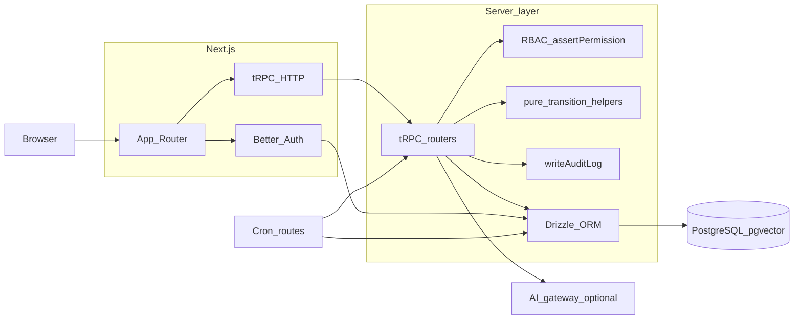

# Architecture map (procurement & technical diligence)

This document answers **how the system works** for investors, operators, and enterprise buyers. It is anchored to the repository as of 2026; product gaps are called out honestly in [Procurement readiness](./procurement-readiness.md).

**Related:** [CONTEXT.md](../CONTEXT.md) (contributor conventions), [COMPLIANCE.md](../COMPLIANCE.md) (governance posture), [Workflow depth](./workflow-depth.md) (state machines and audit patterns).

**QA / acceptance (beyond CI smoke):** [Staging & desk-to-field UAT](./qa/staging-uat-desk-to-field.md) (business sign-off); [Mutation auditability matrix](./qa/mutation-auditability-matrix.md) (`writeAuditLog` coverage inventory).

---

## 1. Product positioning (system of record)

Autonomous EHS is designed as an **IMS-style system of record**: PostgreSQL holds authoritative state for incidents, CAPA, documents, training, internal audits, retention policy, and RAG metadata. **AI and assistants are non-authoritative** until outputs pass validation and are persisted through permission-gated tRPC procedures—see [CONTEXT.md § Security & compliance boundaries](../CONTEXT.md).

---

## 2. End-to-end data flow

- **Dashboard gate:** [`src/proxy.ts`](../src/proxy.ts) + [`src/lib/dashboard-auth-gate.ts`](../src/lib/dashboard-auth-gate.ts) enforce auth on `/dashboard/*`.
- **tRPC root:** [`src/server/trpc/root.ts`](../src/server/trpc/root.ts) registers all domain namespaces (see [CONTEXT.md § API surface map](../CONTEXT.md)).
- **Context Sync REST (`/api/contextsync/*`):** Postgres-backed **`context_sync_*`** blobs + optional scoped grants/provenance; IMS-shaped `ctx://` URIs are **read-only** IMS snapshots; **`X-Agent-Class`** is honored only with org-bound claim rows from **`contextSyncProtocol`** (**`org:admin`**); **`organization.context_sync_enabled`** gates REST + protocol (**403** / **`FORBIDDEN`** when off). Same Upstash sliding-window limiting as gated tRPC callers. Distinguished from tRPC **`context.*`** (ISO *context of the organization* — see CONTEXT.md). Operational note on provenance sizing: [`context-sync-provenance.md`](runbooks/context-sync-provenance.md).

---

## 3. Workflow engine structure

| Concern | Implementation | Notes |
|---------|----------------|--------|
| **Incident lifecycle** | [`src/lib/workflow/incidentTransitions.ts`](../src/lib/workflow/incidentTransitions.ts) | Allowed transitions: `open` → `investigating` → `closed`. Procedures enforce moves via `allowedIncidentTransition`. **Investigation artifacts** (5 Whys, fishbone, bow-tie, event sequence, causal factors) live as `jsonb` on `incident`, updated via [`incident.update`](../src/server/trpc/routers/incident.ts) and the incident detail form; anonymization clears them in [`dataRetention.ts`](../src/server/services/dataRetention.ts). |
| **Inspection workflow** | [`src/lib/workflow/inspectionTransitions.ts`](../src/lib/workflow/inspectionTransitions.ts) | `scheduled` → `in_progress` → `completed` or `cancelled`; router [`inspection.ts`](../src/server/trpc/routers/inspection.ts). |
| **CAPA lifecycle** | [`src/lib/workflow/capaTransitions.ts`](../src/lib/workflow/capaTransitions.ts) | `pending_approval` → `planned` → `in_progress` → `completed` → `verified`. |
| **Approval / escalation** | [`approval` router](../src/server/trpc/routers/approval.ts), `approval_step.dueAt`, cron → `escalation_event` | Serial approvals for **CAPA** and **work permits** (`approval_request.entity_type`), with optional multi-step approvers; overdue pending steps record [`escalation_event`](../src/server/db/schema.ts) rows (no notification channel in MVP). |
| **Permit to work** | [`permitTransitions.ts`](../src/lib/workflow/permitTransitions.ts) + [`permit` router](../src/server/trpc/routers/permit.ts) | User-driven `draft`/`pending_approval`/`active`/terminal moves; authorization to `active` is applied when the final approval step completes (see `decideRequest`). |
| **Environmental regulatory permits** | [`environmentalRegulatoryPermit` router](../src/server/trpc/routers/environmentalRegulatoryPermit.ts) + UI [`/dashboard/environmental-permits`](../src/app/dashboard/environmental-permits/) | **Program register** (air/water/waste metadata, conditions, renewals)—distinct from PTW; links to monitoring/CAPA per schema; not claimed as agency filing ([COMPLIANCE.md](../COMPLIANCE.md)). |
| **Risk assessments (ISO / JSA)** | [`planning.risk`](../src/server/trpc/routers/planning/riskRouter.ts) + [`risk_assessment` / `risk_assessment_step`](../src/server/db/schema.ts), roster [`/dashboard/risk-assessments`](../src/app/dashboard/risk-assessments/) | `assessment_kind` (`general`, `task_based`, `site_based`); task-based rows require steps; command center surfaces overdue `review_due_at` when the user has `risk:read`. |
| **Safety observations** | [`observation` router](../src/server/trpc/routers/observation.ts) | `safety_observation` records (category, severity); optional **`assignee_user_id` / `follow_up_due_at`**; overdue follow-up → **`escalation_event`** (`entity_type` **`safety_observation`**) via cron; optional link to existing CAPA (`linkToCapa`). |
| **Exception handling** | tRPC `TRPCError` + validators | `protectedProcedure` / `protectedMutation` in [`src/server/trpc/init.ts`](../src/server/trpc/init.ts); rate limits for sensitive paths. |

---

## 4. Data model (authoritative)

- **Schema:** [`src/server/db/schema.ts`](../src/server/db/schema.ts) — incidents, corrective actions, **inspections** (workplace/site), **work permits** (`work_permit`), **environmental regulatory permits** (`environmental_regulatory_permit` + conditions), **`risk_assessment`** / **`risk_assessment_step`**, **safety observations** (`safety_observation`), controlled documents, training, internal audits/findings, establishments, OSHA sidecar fields, chemical inventory, RAG sources/chunks, `data_retention_policy`, `audit_log`, etc.
- **Migrations:** `drizzle/migrations/*.sql` — no TypeScript-only “virtual” columns; all DDL is migratable.

---

## 5. Audit trail vs ISO internal audit

| Concept | Table / router | Purpose |
|---------|-----------------|---------|
| **Transactional audit trail** | `audit_log` + [`writeAuditLog`](../src/server/services/audit.ts); read/export via **`compliance.auditTrail.*`** ([`auditTrailRouter.ts`](../src/server/trpc/routers/auditTrailRouter.ts), [`/dashboard/audit-trail`](../src/app/dashboard/audit-trail/page.tsx)) — `list` + **CSV export** (`exportCsv`, `audit_trail:read`, writes `compliance.audit_trail.export_csv`) | Who changed what, when—used across incidents, CAPA, retention, internal audit mutations, integrations, planning, etc. Router-level inventory and refresh discipline: [mutation auditability matrix](./qa/mutation-auditability-matrix.md). |
| **ISO programme audits** | `internalAudit` domain + [`internalAudit` router](../src/server/trpc/routers/internalAudit.ts) | Audit **programme** records and findings—**not** a synonym for `audit_log`. UX and docs must keep terminology distinct ([ehs-ims-conventions](../.cursor/rules/ehs-ims-conventions.mdc)). |

---

## 6. Permissions model (RBAC)

- **Keys:** [`src/lib/rbac.ts`](../src/lib/rbac.ts) — `PERMISSIONS` is the only source of permission strings.
- **Enforcement:** `assertPermission` on regulated procedures; seeds grant roles via [`scripts/seed.ts`](../scripts/seed.ts) / demo seed.
- **Sensitive incident data:** Narrow reads where `incident:read_sensitive` and related keys apply ([`incident` router](../src/server/trpc/routers/incident.ts), [COMPLIANCE.md](../COMPLIANCE.md)).

---

## 7. Compliance evidence & retention design

- **Retention services:** [`src/server/services/dataRetention.ts`](../src/server/services/dataRetention.ts) (incidents, **`safety_observation`**, **`work_permit`**, **`environmental_regulatory_permit`**, **`risk_assessment`** when `retain_until` populated per policy class), [`src/server/services/incidentRetentionDefault.ts`](../src/server/services/incidentRetentionDefault.ts) (default `retain_until` from org policy for incidents and program entities).
- **Cron:** [`src/app/api/cron/data-retention/route.ts`](../src/app/api/cron/data-retention/route.ts) (scheduled in [`vercel.ts`](../vercel.ts)).
- **Policy & process:** [COMPLIANCE.md](../COMPLIANCE.md); org-facing procedures under `compliance.*` in tRPC.

---

## 8. Decision engine / automation logic

- **AI:** All provider calls go through [`src/lib/ai/gateway.ts`](../src/lib/ai/gateway.ts); structured outputs validated with Zod ([`src/lib/ai/structured.ts`](../src/lib/ai/structured.ts)).
- **RAG:** `rag.*` procedures ([`src/server/trpc/routers/rag.ts`](../src/server/trpc/routers/rag.ts)); ingest applies PII redaction ([`src/lib/pii/redact.ts`](../src/lib/pii/redact.ts)).
- **Human-in-loop:** Product policy—do not auto-close investigations, auto-verify CAPA effectiveness, or commit regulatory classification without explicit approval paths ([CONTEXT.md](../CONTEXT.md)).

---

## 9. Integrations map

| Status | Surface | Role |
|--------|---------|------|
| **In-repo stub / event log** | [`integration` router](../src/server/trpc/routers/integration.ts), `integration_event`, `integration_inbound_idempotency`, `integration_connector_mapping` | Enqueue/list pattern; **idempotent inbound** via optional JSON `idempotencyKey` on [`POST /api/integration/inbound`](../src/app/api/integration/inbound/route.ts); with **`PG_BOSS_ENABLED`**, HRIS bodies **queue** (`202`) to [`integration.inboundHris`](../src/server/jobs/types.ts) and [`scripts/job-worker.ts`](../scripts/job-worker.ts). Audited **NDJSON export** for warehouses (`integration.exportEventsWarehouseSlice`, `integration:read`); **tRPC** + inbound insert `training_completion` / HRIS events with redacted worker ids in `payload`. Per-tenant LMS/HRIS **field-mapping JSON** persists for operator runbooks (`integration.listConnectorMappings` / `integration.upsertConnectorMapping`; see [`docs/integration-connector-mapping.md`](integration-connector-mapping.md)). |
| **Operational outbound webhooks** | `operational_webhook_endpoint`, `organization.operationalWebhooksPanel`, cron [`reminders`](../src/app/api/cron/reminders/route.ts) | Org admins POST JSON to HTTPS receivers—**observation follow-up escalations**, **overdue approval-step escalations** (`approval.step_escalated`), **credential batch expiry** (`program.credential_batch_expired`), and **integration processing_failed** payloads; signed with optional shared secret (`X-EHS-Signature`). See [`docs/operational-webhooks.md`](operational-webhooks.md). |
| **Planned / partner-built** | — | ERP, LMS/HRIS productized catalogs, e-signature, and document DMS integrations remain roadmap—architecture supports org-scoped events and auditability. **CTO remediation specs:** [procurement-integrations-appendix.md](./procurement-integrations-appendix.md), [hris-portco-integration-playbook.md](./roadmap/hris-portco-integration-playbook.md), [adr/0001-mcp-context-sync-strategy.md](./adr/0001-mcp-context-sync-strategy.md). |

---

## 10. Contractor compliance wedge (PDF priority)

[`external_party`](../src/server/db/schema.ts) models contractors, visitors, and temporary workers (program router). **`external_party_credential`** stores compliance artifacts (insurance COI, permit, training proof) with validity dates and evidence links; procedures live under **`externalParty.*`** in tRPC ([`externalParty` router](../src/server/trpc/routers/externalParty.ts)); UI: **`/dashboard/contractors`**.

**Roadmap:** visitor kiosks, automated renewal queues, and deep LMS/HRIS integration—see [procurement-readiness.md § Initial wedge](./procurement-readiness.md).

---

## 11. Health & operations

- **Liveness + DB ping:** [`src/app/api/health/route.ts`](../src/app/api/health/route.ts) — `GET /api/health`.
- **Cron run metrics (scrape):** [`src/app/api/cron/metrics/route.ts`](../src/app/api/cron/metrics/route.ts) — `GET /api/cron/metrics` returns Prometheus text or JSON rollups over `cron_job_run`; same `Bearer` `CRON_SECRET` gate as other cron handlers; intended for external monitoring/SLO dashboards (not a `vercel.ts` scheduled path).
- **Demo guard:** [`src/instrumentation.ts`](../src/instrumentation.ts) blocks `DEMO_MODE` on Vercel production.

For **deployment** topology (Vercel, Kubernetes, Docker), see [README.md](../README.md), [`vercel.ts`](../vercel.ts), and [`.cursor/skills/devops-sre/SKILL.md`](../.cursor/skills/devops-sre/SKILL.md).

---

## 12. Partnership roadmap alignment (field + analytics + assistant)

Tracked in [ROADMAP.md § Partnership backlog](../ROADMAP.md): **offline/outbox** when `NEXT_PUBLIC_FIELD_OUTBOX=1` ([`src/lib/offline/fieldOutbox.ts`](../src/lib/offline/fieldOutbox.ts), global replay in [`src/components/field-outbox-global-sync.tsx`](../src/components/field-outbox-global-sync.tsx)) — see [`docs/offline-field-outbox.md`](offline-field-outbox.md); replays **`incident.create`**, **`observation.create`**, **`inspection.create`**, **`inspection.updateStatus`**, **`permit.create`**, **`permit.submitForApproval`**, **`environmentalRegulatoryPermit.create`**, **`environmentalRegulatoryPermit.submitForApproval`**, **`planning.risk.create`** through the same tRPC + RBAC surfaces; **assistive drafting** includes [`aiAssistant.proposeObservationIntakeDraft`](../src/server/trpc/routers/aiAssistant.ts) and is documented in [`docs/ai-governed-intake.md`](ai-governed-intake.md); **observation SLA / escalation** uses `assignee_user_id` / `follow_up_due_at` plus overdue **`escalation_event`** (`entity_type` **`safety_observation`**); **`analytics.leadingIndicators`** surfaces repeat-cluster and overdue-follow-up aggregates. Statutory filings remain scoped to COMPLIANCE-led exports in [§ 7 Compliance evidence](#7-compliance-evidence--retention-design). **Retention and legal hold** rules ([COMPLIANCE.md](../COMPLIANCE.md)) govern destruction of authoritative rows regardless of client-side drafts.
