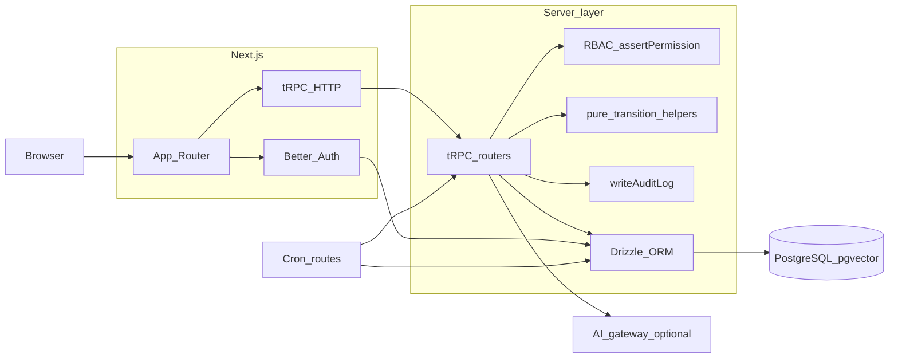

# Architecture map (procurement & technical diligence)

This document answers **how the system works** for investors, operators, and enterprise buyers. It is anchored to the repository as of 2026; product gaps are called out honestly in [Procurement readiness](./procurement-readiness.md).

**Related:** [CONTEXT.md](../CONTEXT.md) (contributor conventions), [COMPLIANCE.md](../COMPLIANCE.md) (governance posture), [Workflow depth](./workflow-depth.md) (state machines and audit patterns).

---

## 1. Product positioning (system of record)

Autonomous EHS is designed as an **IMS-style system of record**: PostgreSQL holds authoritative state for incidents, CAPA, documents, training, internal audits, retention policy, and RAG metadata. **AI and assistants are non-authoritative** until outputs pass validation and are persisted through permission-gated tRPC procedures—see [CONTEXT.md § Security & compliance boundaries](../CONTEXT.md).

---

## 2. End-to-end data flow

- **Dashboard gate:** [`src/proxy.ts`](../src/proxy.ts) + [`src/lib/dashboard-auth-gate.ts`](../src/lib/dashboard-auth-gate.ts) enforce auth on `/dashboard/*`.
- **tRPC root:** [`src/server/trpc/root.ts`](../src/server/trpc/root.ts) registers all domain namespaces (see [CONTEXT.md § API surface map](../CONTEXT.md)).

---

## 3. Workflow engine structure

| Concern | Implementation | Notes |
|---------|----------------|--------|
| **Incident lifecycle** | [`src/lib/workflow/incidentTransitions.ts`](../src/lib/workflow/incidentTransitions.ts) | Allowed transitions: `open` → `investigating` → `closed`. Procedures enforce moves via `allowedIncidentTransition`. |
| **Inspection workflow** | [`src/lib/workflow/inspectionTransitions.ts`](../src/lib/workflow/inspectionTransitions.ts) | `scheduled` → `in_progress` → `completed` or `cancelled`; router [`inspection.ts`](../src/server/trpc/routers/inspection.ts). |
| **CAPA lifecycle** | [`src/lib/workflow/capaTransitions.ts`](../src/lib/workflow/capaTransitions.ts) | `pending_approval` → `planned` → `in_progress` → `completed` → `verified`. |
| **Approval / escalation** | [`approval` router](../src/server/trpc/routers/approval.ts), `approval_step.dueAt`, cron → `escalation_event` | Serial CAPA plan approvals with optional multi-step approvers; overdue pending steps record [`escalation_event`](../src/server/db/schema.ts) rows (no notification channel in MVP). |
| **Exception handling** | tRPC `TRPCError` + validators | `protectedProcedure` / `protectedMutation` in [`src/server/trpc/init.ts`](../src/server/trpc/init.ts); rate limits for sensitive paths. |

---

## 4. Data model (authoritative)

- **Schema:** [`src/server/db/schema.ts`](../src/server/db/schema.ts) — incidents, corrective actions, **inspections** (workplace/site), controlled documents, training, internal audits/findings, establishments, OSHA sidecar fields, chemical inventory, RAG sources/chunks, `data_retention_policy`, `audit_log`, etc.
- **Migrations:** `drizzle/migrations/*.sql` — no TypeScript-only “virtual” columns; all DDL is migratable.

---

## 5. Audit trail vs ISO internal audit

| Concept | Table / router | Purpose |
|---------|-----------------|---------|
| **Transactional audit trail** | `audit_log` + [`writeAuditLog`](../src/server/services/audit.ts) | Who changed what, when—used across incidents, CAPA, retention, internal audit mutations, integrations, planning, etc. |
| **ISO programme audits** | `internalAudit` domain + [`internalAudit` router](../src/server/trpc/routers/internalAudit.ts) | Audit **programme** records and findings—**not** a synonym for `audit_log`. UX and docs must keep terminology distinct ([ehs-ims-conventions](../.cursor/rules/ehs-ims-conventions.mdc)). |

---

## 6. Permissions model (RBAC)

- **Keys:** [`src/lib/rbac.ts`](../src/lib/rbac.ts) — `PERMISSIONS` is the only source of permission strings.
- **Enforcement:** `assertPermission` on regulated procedures; seeds grant roles via [`scripts/seed.ts`](../scripts/seed.ts) / demo seed.
- **Sensitive incident data:** Narrow reads where `incident:read_sensitive` and related keys apply ([`incident` router](../src/server/trpc/routers/incident.ts), [COMPLIANCE.md](../COMPLIANCE.md)).

---

## 7. Compliance evidence & retention design

- **Retention services:** [`src/server/services/dataRetention.ts`](../src/server/services/dataRetention.ts), [`src/server/services/incidentRetentionDefault.ts`](../src/server/services/incidentRetentionDefault.ts).
- **Cron:** [`src/app/api/cron/data-retention/route.ts`](../src/app/api/cron/data-retention/route.ts) (scheduled in [`vercel.ts`](../vercel.ts)).
- **Policy & process:** [COMPLIANCE.md](../COMPLIANCE.md); org-facing procedures under `compliance.*` in tRPC.

---

## 8. Decision engine / automation logic

- **AI:** All provider calls go through [`src/lib/ai/gateway.ts`](../src/lib/ai/gateway.ts); structured outputs validated with Zod ([`src/lib/ai/structured.ts`](../src/lib/ai/structured.ts)).
- **RAG:** `rag.*` procedures ([`src/server/trpc/routers/rag.ts`](../src/server/trpc/routers/rag.ts)); ingest applies PII redaction ([`src/lib/pii/redact.ts`](../src/lib/pii/redact.ts)).
- **Human-in-loop:** Product policy—do not auto-close investigations, auto-verify CAPA effectiveness, or commit regulatory classification without explicit approval paths ([CONTEXT.md](../CONTEXT.md)).

---

## 9. Integrations map

| Status | Surface | Role |
|--------|---------|------|
| **In-repo stub / event log** | [`integration` router](../src/server/trpc/routers/integration.ts), `integration_event` | Enqueue/list pattern; **`ingestTrainingCompletion`** (tRPC) and **`POST /api/integration/inbound`** (Bearer `INTEGRATION_INBOUND_SECRET`) insert `training_completion` events with redacted worker ids in `payload`. |
| **Planned / partner-built** | — | ERP, LMS, HRIS, e-signature, and document DMS integrations are **roadmap** items—architecture supports org-scoped events and auditability; specific connectors are not implied by the stub alone. |

---

## 10. Contractor compliance wedge (PDF priority)

[`external_party`](../src/server/db/schema.ts) models contractors, visitors, and temporary workers (program router). **`external_party_credential`** stores compliance artifacts (insurance COI, permit, training proof) with validity dates and evidence links; procedures live under **`externalParty.*`** in tRPC ([`externalParty` router](../src/server/trpc/routers/externalParty.ts)); UI: **`/dashboard/contractors`**.

**Roadmap:** visitor kiosks, automated renewal queues, and deep LMS/HRIS integration—see [procurement-readiness.md § Initial wedge](./procurement-readiness.md).

---

## 11. Health & operations

- **Liveness + DB ping:** [`src/app/api/health/route.ts`](../src/app/api/health/route.ts) — `GET /api/health`.
- **Demo guard:** [`src/instrumentation.ts`](../src/instrumentation.ts) blocks `DEMO_MODE` on Vercel production.

For **deployment** topology (Vercel, Kubernetes, Docker), see [README.md](../README.md), [`vercel.ts`](../vercel.ts), and [`.cursor/skills/devops-sre/SKILL.md`](../.cursor/skills/devops-sre/SKILL.md).
