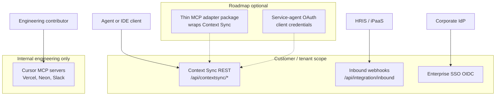

# Procurement appendix — integrations, HRIS, and agent access

This appendix supports **RFP / diligence** conversations for PortCo and enterprise buyers. It clarifies what ships today, what requires partner or customer middleware, and how to answer **“MCP integration”** questions without conflating internal engineering tooling with tenant-facing product.

**Related docs:** [procurement-readiness.md](./procurement-readiness.md), [architecture-map.md](./architecture-map.md) §9, [cursor-tool-connections-deployment.md](./cursor-tool-connections-deployment.md), [CONTEXT.md](../CONTEXT.md) (Context Sync REST).

---

## 1. Integration scope summary

| Capability | Ships today | Buyer-facing statement |
|------------|-------------|------------------------|
| **Enterprise SSO (OIDC pilot)** | Optional Better Auth Generic OAuth when `OIDC_*` env vars are set | Supports corporate IdP sign-in; **does not** auto-provision tenants or map IdP groups to orgs without additional configuration ([OIDC_JIT_PROVISIONING.md](./OIDC_JIT_PROVISIONING.md)). |
| **Inbound integration webhook** | `POST /api/integration/inbound` with bearer `INTEGRATION_INBOUND_SECRET` | Canonical JSON envelopes for LMS and HRIS events; idempotent replays; optional async processing via pg-boss ([JOB_QUEUE.md](./JOB_QUEUE.md)). |
| **HRIS membership sync** | `hris_membership_sync` envelope v2 | Provisions **joiners** (user + membership), updates site/department/manager/employment for org members; terminated → deprovision + session revoke. |
| **LMS training completion** | `training_completion` envelope | Upserts `training_record` when `externalWorkerId` matches membership; always logs `integration_event`. |
| **HRIS contractor sync** | `hris_contractor_sync` envelope | Upserts `external_party` by `externalWorkerId` (PortCo contractor wedge). |
| **Roster reconciliation** | `roster_snapshot` inbound + `integration.reconcileRoster` job | Compares HRIS export to active memberships; drift widget on `/dashboard/integrations`. |
| **Integration operator UI** | `/dashboard/integrations` | Event backlog, connector mapping JSON, operational webhooks, warehouse export slice. |
| **Outbound operational webhooks** | Org-configured HTTPS POST + HMAC | Failure notifications and SLA escalations — see [operational-webhooks.md](./operational-webhooks.md). |
| **Context Sync REST (agent read)** | `/api/contextsync/*` when tenant opt-in enabled | Governed read/sync for IDE and agent clients — **not** branded as MCP; see §3. |
| **Named HRIS connectors (Workday, ADP, BambooHR)** | **Not productized** | iPaaS or SI middleware maps vendor APIs to canonical envelopes — see [hris-portco-integration-playbook.md](./roadmap/hris-portco-integration-playbook.md). |
| **SCIM / directory sync** | **Shipped (MVP)** | `POST/PATCH/DELETE /api/scim/v2/Users`, `GET/PATCH /api/scim/v2/Groups`, per-org bearer token, group→role mapping UI on `/dashboard/integrations`. |
| **Customer MCP server** | **Not shipped** | Governed agent access via Context Sync REST; optional MCP adapter on roadmap — see [adr/0001-mcp-context-sync-strategy.md](./adr/0001-mcp-context-sync-strategy.md). |
| **Cursor MCP (Vercel, Neon, Slack, etc.)** | **Internal dev tooling only** | Contributor IDE ergonomics — **never** list as a customer integration ([cursor-tool-connections-deployment.md](./cursor-tool-connections-deployment.md)). |

---

## 2. HRIS webhook — honest limits

### What `hris_membership_sync` does

Upstream systems (HRIS, iPaaS, or custom middleware) POST a canonical payload validated by [`src/lib/integration/inboundEnvelope.ts`](../src/lib/integration/inboundEnvelope.ts):

```json
{
  "kind": "hris_membership_sync",
  "organizationId": "<uuid>",
  "workerEmail": "worker@example.com",
  "siteId": "<optional-site-uuid>",
  "idempotencyKey": "optional-replay-key"
}
```

Processing ([`src/server/services/hrisMembershipSyncIngest.ts`](../src/server/services/hrisMembershipSyncIngest.ts)):

1. Normalizes `workerEmail` and **provisions user + membership** when the worker is new (HRIS v2 joiner path).
2. Updates site, department, job title, manager, cost center, and `externalWorkerId` for existing members.
3. `employmentStatus: terminated` → `deprovisioned` lifecycle + session revoke (soft deprovision; regulated history retained).
4. Writes `audit_log` (`integration.hris_membership_sync`) and updates `integration_event` status.

### What it does **not** do

| Limit | Implication for PortCo rollout |
|-------|--------------------------------|
| **No user creation** | ~~New hires…~~ **Resolved:** HRIS v2 provisions user + membership when worker email is new. SCIM remains preferred for IdP-driven JML. |
| **No membership creation** | ~~HRIS cannot add…~~ **Resolved** via HRIS provision path and SCIM Users API. |
| **No role / RBAC updates** | SCIM **Groups** PATCH updates role via `scim_group_mapping`; HRIS webhook does not change roles. |
| **No deprovisioning** | **Partial:** `employmentStatus: terminated` or SCIM deactivate sets `deprovisioned` and revokes sessions. |
| **Site assignment only** | ~~Department, manager…~~ **Resolved:** v2 envelope fields apply on inbound sync. |
| **Connector mapping JSON is documentation** | Rows in `integration_connector_mapping` do **not** transform payloads at runtime ([integration-connector-mapping.md](./integration-connector-mapping.md)). |

### Failure handling

- Processing failures mark `integration_event` as `failed` and may emit `integration.processing_failed` on configured operational webhooks.
- Common errors: `"No user matches workerEmail"`, `"User is not a member of this organization"`, invalid `siteId`.
- Operators monitor `/dashboard/integrations` and may reprocess failed events when root cause is fixed.

### Typical PortCo path today

1. Configure **OIDC SSO** against corporate IdP (often shared with HRIS identity) **or** SCIM provisioning from IdP.
2. Configure **multi-org OIDC JIT claim rules** or **SCIM group→role mappings** on `/dashboard/integrations` for PE portfolio entities.
3. Route HRIS location/worker updates through **Workato / Boomi / custom worker** → canonical webhook (see runbooks in `docs/runbooks/`).
4. Enable **`PG_BOSS_ENABLED`** + job worker for durable HRIS ingest; configure operational webhooks for `integration.processing_failed`.
5. Optional: nightly `roster_snapshot` + cron `/api/cron/integration-roster-reconcile` for drift monitoring.

---

## 3. Context Sync vs MCP — diligence framing

Buyers increasingly ask for **“MCP integrations.”** In questionnaires, distinguish three layers:



### Context Sync REST (ships)

- **Purpose:** Governed read/sync of `ctx://` artifacts and read-only IMS snapshots for agents and IDE tooling.
- **Tenant control:** `organization.context_sync_enabled` (default `false` for new orgs); org admin toggle with audit.
- **Auth:** Better Auth session; `X-Actor-Id` must equal `human:{session.user.id}`; optional `X-Agent-Class` with org-bound claims.
- **Writes to regulated IMS data:** Blocked on Context Sync paths — mutations stay on tRPC / dashboard (compliance boundary).
- **Rate limits:** Upstash sliding window; optional per-org daily read quota and provenance caps ([CONTEXT.md](../CONTEXT.md)).

**RFP answer template:** *“Autonomous EHS provides a governed Context Sync REST API for agent and IDE read access to compliance context, with tenant opt-in, RBAC, grants, provenance, and rate limits. Regulated workflow mutations remain on authenticated tRPC procedures and the EHS Console.”*

### MCP (Model Context Protocol)

| Question | Answer |
|----------|--------|
| Do you ship a customer MCP server? | **No** — not in this repository today. |
| Can agents access EHS data? | **Yes** — via Context Sync REST under a human session (and future service identities per ADR). |
| Will you support MCP? | **Optional roadmap** — thin adapter wrapping Context Sync; decision in [adr/0001-mcp-context-sync-strategy.md](./adr/0001-mcp-context-sync-strategy.md). |
| Is Cursor MCP a product feature? | **No** — internal contributor tooling only. |

### Do not conflate

- **HRIS integration** = identity, roster, site assignment (who works where).
- **Context Sync / MCP** = agent read access to compliance artifacts (what the system knows).
- **Cursor MCP** = how engineers deploy and operate the SaaS — not a PortCo adoption path.

---

## 4. RFP risk register (integration-specific)

Add these rows to diligence responses alongside [procurement-readiness.md](./procurement-readiness.md) §12:

| Risk / question | Current state | Buyer-facing statement |
|-----------------|---------------|-------------------------|
| **Turnkey Workday connector** | iPaaS playbooks + fixtures ship; no native OAuth module | Workday RAAS/EIB → iPaaS → canonical webhook; native Workday REST OAuth is **optional roadmap** only. |
| **Automated joiner/mover/leaver** | **Shipped** — HRIS v2 provision path + SCIM Users API + `employmentStatus: terminated` deprovision | IdP SCIM preferred for user create; HRIS webhook handles site/department/manager updates. |
| **LMS → training records** | **Shipped** — inbound upserts `training_record` when worker id matches membership | Completions are auditable events **and** reconcile into training records. |
| **MCP server in product** | Not shipped | Context Sync REST is the supported agent interoperability surface; MCP adapter is optional future packaging. |
| **Multi-entity PE portfolio** | **Shipped (pilot)** — OIDC JIT claim rules + SCIM group→role mappings per org | Map IdP groups or claims to org UUID + role template; fail-closed when no rule matches. |

---

## 5. Roadmap pointers (corrective actions)

| Theme | Design doc |
|-------|------------|
| Next-action dashboard UX | [roadmap/action-queue-dashboard-spec.md](./roadmap/action-queue-dashboard-spec.md) |
| PortCo HRIS / SCIM / Workday | [roadmap/hris-portco-integration-playbook.md](./roadmap/hris-portco-integration-playbook.md) |
| MCP vs Context Sync strategy | [adr/0001-mcp-context-sync-strategy.md](./adr/0001-mcp-context-sync-strategy.md) |

---

## 6. Implementation methodology reminder

For enterprise pilots, the **Integrate** phase in [procurement-readiness.md](./procurement-readiness.md) §2 should assume:

1. **Discover** — Which HRIS, IdP, and iPaaS the PortCo already operates.
2. **Configure** — SSO, inbound secret, org/sites, RBAC roles.
3. **Integrate** — Middleware → canonical webhook; Context Sync opt-in if agents need read access.
4. **Verify** — Integration event health, failed-event webhooks, UAT on [staging-uat-desk-to-field.md](./qa/staging-uat-desk-to-field.md).
5. **Operate** — Monitor `/dashboard/integrations`, warehouse exports, audit trail.

Track barrier resolution in [barrier-resolution-playbook.md](./barrier-resolution-playbook.md) when integration owners are assigned.
