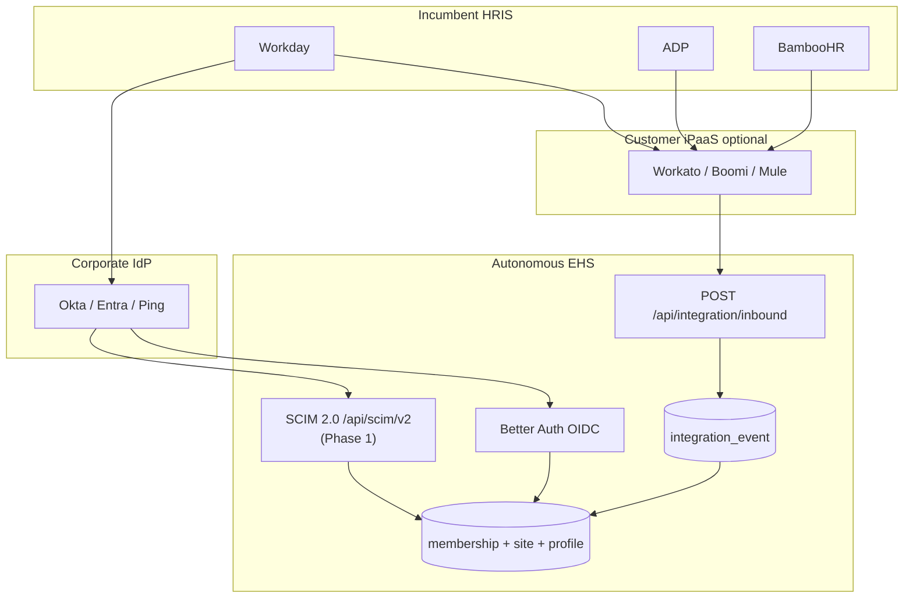

# PortCo HRIS integration playbook

**Status:** Phase 1 identity **shipped** (HRIS v2 envelope, SCIM MVP, multi-org OIDC JIT rules UI). Phase 2 iPaaS playbooks + fixtures in `tests/fixtures/integration/`. Phase 3 reconciliation/LMS depth remains roadmap.  
**Addresses:** CTO feedback on Workday/HRIS integrations for private-equity portfolio company (PortCo) adoption.  
**Related:** [procurement-integrations-appendix.md](../procurement-integrations-appendix.md), [integration-connector-mapping.md](../integration-connector-mapping.md), [OIDC_JIT_PROVISIONING.md](../OIDC_JIT_PROVISIONING.md), [JOB_QUEUE.md](../JOB_QUEUE.md).

---

## 1. Executive summary

Autonomous EHS ships **integration plumbing** today (inbound webhook, event log, OIDC SSO pilot, operator UI). It does **not** ship productized Workday, ADP, or BambooHR connectors or SCIM directory sync.

This playbook defines:

1. **Phase 1** — PortCo-ready identity (SCIM, multi-org OIDC JIT, extended HRIS envelope).
2. **Phase 2** — Named connector packages via **iPaaS-first** recipes (Workday, ADP, BambooHR).
3. **Phase 3** — Reconciliation, LMS depth, contractor lifecycle.

---

## 2. Current state (baseline)

| Component | Location | Behavior |
|-----------|----------|----------|
| Inbound webhook | [`src/app/api/integration/inbound/route.ts`](../../src/app/api/integration/inbound/route.ts) | Bearer secret; Zod-validated envelopes |
| HRIS envelope | [`src/lib/integration/inboundEnvelope.ts`](../../src/lib/integration/inboundEnvelope.ts) | `workerEmail`, `organizationId`, optional `siteId` |
| HRIS apply | [`src/server/services/hrisMembershipSyncIngest.ts`](../../src/server/services/hrisMembershipSyncIngest.ts) | Updates `membership.siteId` for **existing** member |
| Async processing | [`docs/JOB_QUEUE.md`](../JOB_QUEUE.md) | `202` + pg-boss job when `PG_BOSS_ENABLED=true` |
| OIDC JIT | [`docs/OIDC_JIT_PROVISIONING.md`](../OIDC_JIT_PROVISIONING.md) | Single default org + role on first SSO sign-in |
| Operator UI | [`/dashboard/integrations`](../../src/app/dashboard/integrations/page.tsx) | Events, mapping JSON, webhooks, export |

**PortCo gap:** No joiner/mover/leaver automation; no multi-legal-entity IdP group mapping; HRIS sync is site-only.

---

## 3. Target architecture



**Principle:** Preserve the **canonical inbound envelope** pattern — vendor-specific transforms live in iPaaS or a thin connector worker, not in core app code, until native OAuth connectors (Phase 3 optional) justify maintenance.

---

## 4. Phase 1 — PortCo-ready identity

### 4.1 SCIM 2.0 provisioning (design)

**New surface:** `POST/PATCH/DELETE /api/scim/v2/Users`, `Groups` (or subset: Users + Group membership).

| Requirement | Design choice |
|-------------|---------------|
| Auth | Bearer token per org (`SCIM_BEARER_TOKEN` or rotatable secret in org settings table) |
| User create | Create `auth_user` + `membership` + default role template |
| User update | Email change policy per counsel; update display name / external id |
| Deactivate | Set membership inactive flag (new column) or revoke sessions — **counsel + IAM review** |
| Group → org + role | Map IdP group id to `(organizationId, roleSlug)` via `scim_group_mapping` table |
| Audit | Every SCIM mutation → `audit_log` |

**Schema migrations (Drizzle):**

- `membership.externalId` (HRIS worker id)
- `membership.status` enum: `active`, `suspended`, `deprovisioned`
- `membership.department`, `membership.jobTitle`, `membership.managerUserId` (nullable FK)
- `scim_group_mapping` (org id, idp group id, role slug)

**Permissions:** SCIM operations use service identity — not end-user RBAC.

**Non-goals in v1 SCIM:** PATCH complex nested enterprise extensions; bi-directional sync back to HRIS.

### 4.2 Multi-org OIDC JIT (design)

Extend [`oidcJitProvisioning.ts`](../../src/server/services/oidcJitProvisioning.ts):

| Today | Target |
|-------|--------|
| Single `OIDC_JIT_DEFAULT_ORG_ID` | IdP **group / claim → org + role** mapping table |
| Default role slug | Per-mapping role template |
| All IdP users → one org | PE portfolio: `legal_entity_id` claim → org UUID |

**Env / config:**

- `oidc_jit_claim_mapping` JSON or DB table: `{ "claim": "groups", "rules": [{ "match": "EHS-Plant-A", "organizationId": "...", "roleSlug": "supervisor" }] }`
- Fallback: deny JIT if no rule matches (fail closed for enterprise)

**Operational checklist:** Extend [OIDC_JIT_PROVISIONING.md](../OIDC_JIT_PROVISIONING.md) with multi-org section when implemented.

### 4.3 Extended `hris_membership_sync` envelope (design)

Proposed v2 fields (backward compatible — all optional except existing required fields):

```typescript
{
  kind: "hris_membership_sync",
  organizationId: string,
  workerEmail: string,
  siteId?: string | null,
  externalWorkerId?: string | null,
  department?: string | null,
  jobTitle?: string | null,
  managerEmail?: string | null,
  costCenter?: string | null,
  employmentStatus?: "active" | "terminated" | "leave",
  idempotencyKey?: string
}
```

**Processing rules:**

- `employmentStatus: terminated` → suspend membership (after SCIM/JML policy defined); never hard-delete regulated history.
- `managerEmail` → resolve to `managerUserId` when manager exists in org.
- `externalWorkerId` → store on `membership.externalId`.

Requires Drizzle migration + updated [`hrisMembershipSyncIngest.ts`](../../src/server/services/hrisMembershipSyncIngest.ts) + envelope Zod schema version bump documented in connector mapping `schema_version`.

---

## 5. Phase 2 — Named connector packages (iPaaS-first)

Each **certified playbook** includes: field mapping table, sample payloads, test fixtures, dashboard preset JSON for `integration_connector_mapping`, and runbook for failures.

### 5.1 Workday

**Typical PortCo path:** Workday → corporate IdP (SSO) + Workato/Boomi → EHS webhook + SCIM via IdP.

| Workday field | EHS target | Notes |
|---------------|------------|-------|
| `Worker_Email` | `workerEmail` | Primary match key |
| `Worker_ID` | `externalWorkerId` | v2 envelope |
| `Location_ID` / cost center | `siteId` | Map via lookup table Workday location → EHS `site.id` |
| `Supervisory_Organization` | `department` | v2 |
| `Job_Profile` | `jobTitle` | v2 |
| `Manager_Email` | `managerEmail` | v2 |
| `Active_Status` | `employmentStatus` | Map terminated / on leave |

**Sample iPaaS → inbound payload:**

```json
{
  "kind": "hris_membership_sync",
  "organizationId": "11111111-1111-1111-1111-111111111111",
  "workerEmail": "alex.worker@portco.example",
  "siteId": "22222222-2222-2222-2222-222222222222",
  "externalWorkerId": "WD-10482",
  "department": "Operations — Plant 3",
  "jobTitle": "Production Supervisor",
  "managerEmail": "sam.manager@portco.example",
  "employmentStatus": "active",
  "idempotencyKey": "workday:WD-10482:2026-05-24"
}
```

**Connector mapping preset** (`connector_key: hris_inbound`, `schema_version: 2`):

```json
{
  "vendor": "workday",
  "notesForOperators": "Map Workday Worker_ID → externalWorkerId; maintain location→siteId CSV in iPaaS",
  "workdayReport": "RPT_EHS_Worker_Site_Sync",
  "trigger": "daily + on effective date change"
}
```

**Workday integration modes:**

| Mode | When to use |
|------|-------------|
| **RAAS / EIB export → iPaaS** | Most PortCos; no OAuth app in EHS |
| **Workday REST (OAuth)** | Phase 3 native connector; high maintenance |

### 5.2 ADP Workforce Now

| ADP field | EHS target |
|-----------|------------|
| `associateOID` | `externalWorkerId` |
| `businessCommunication.emails` | `workerEmail` |
| `workAssignments.homeWorkLocation` | Map to `siteId` |
| `workerStatus.statusCode` | `employmentStatus` |

Trigger: ADP webhook subscription or scheduled ADP API poll in iPaaS → same canonical JSON.

### 5.3 BambooHR

| BambooHR field | EHS target |
|----------------|------------|
| `id` | `externalWorkerId` |
| `workEmail` | `workerEmail` |
| `location` | Map to `siteId` via lookup |
| `department`, `jobTitle` | v2 fields |
| `supervisorEEmail` | `managerEmail` |

Mid-market PortCos often use BambooHR + Okta; SCIM from Okta handles **user create**, BambooHR webhook handles **site/department** updates.

---

## 6. Phase 3 — Reconciliation & LMS depth

### 6.1 Nightly roster reconciliation

**Job:** `integration.reconcileRoster` (cron or pg-boss scheduled).

1. Load latest HRIS export snapshot (S3/blob or warehouse table populated by iPaaS).
2. Diff against active `membership` rows for org.
3. Emit `integration_event` rows for mismatches; optional auto-apply when policy allows.
4. Dashboard widget: “Roster drift: N workers in HRIS not in EHS.”

### 6.2 LMS → training records

Today [`training_completion`](../../src/lib/integration/trainingCompletion.ts) logs events only.

**Target:** Match `externalWorkerId` or email → `userId`; upsert `training_record` with course code, completion date, expiry; audit log.

### 6.3 Contractor lifecycle

Link HRIS/VMS contractor workers to [`external_party`](../../src/server/trpc/routers/externalParty.ts) per [procurement-readiness.md](../procurement-readiness.md) §9 wedge.

---

## 7. Security & compliance

- **Secrets:** `INTEGRATION_INBOUND_SECRET` and future SCIM tokens — rotate per org; never log bearer tokens.
- **PII:** HRIS payloads contain work email — align retention with [COMPLIANCE.md](../../COMPLIANCE.md); redact in warehouse exports where applicable.
- **Least privilege:** iPaaS service account scoped to single org UUID.
- **Audit:** All applied HRIS syncs already write `audit_log`; SCIM must match.
- **Counsel review:** Termination handling, contractor vs employee classification, cross-border data transfer for global PortCos.

---

## 8. Pilot checklist (PortCo)

### Discover

- [ ] HRIS vendor (Workday / ADP / BambooHR / other)
- [ ] IdP (Okta, Entra, Ping)
- [ ] Existing iPaaS (Workato, Boomi, none)
- [ ] Legal entities → EHS org mapping
- [ ] Site/location master in EHS vs HRIS

### Configure

- [ ] OIDC SSO + JIT mapping rules (or SCIM when shipped)
- [ ] EHS sites created with stable ids for location mapping
- [ ] RBAC role templates per PortCo function
- [ ] `INTEGRATION_INBOUND_SECRET` in iPaaS vault

### Integrate

- [ ] iPaaS recipe tested in staging with synthetic workers
- [ ] Idempotency keys verified on replay
- [ ] Failed-event operational webhook to SIEM/Teams

### Verify

- [ ] Joiner: new worker appears in EHS (post SCIM) + correct site after HRIS webhook
- [ ] Mover: site change propagates within SLA
- [ ] Leaver: deprovision policy executed (suspend, not delete)
- [ ] `/dashboard/integrations` shows applied events

### Operate

- [ ] Weekly failed-event review
- [ ] Quarterly location mapping audit
- [ ] Warehouse export for analytics if required

---

## 9. Implementation sequencing

| Order | Deliverable | Depends on |
|-------|-------------|------------|
| 1 | Extended HRIS envelope v2 + membership columns | Drizzle migration |
| 2 | Multi-org OIDC JIT mapping | Auth hook + config table |
| 3 | SCIM Users + group mapping MVP | Service auth + migrations |
| 4 | Workday iPaaS playbook assets (this doc + test fixtures in `tests/fixtures/integration/`) | v2 envelope |
| 5 | Roster reconciliation job | Warehouse or snapshot ingest |
| 6 | LMS → training_record | User matching service |
| 7 | Native Workday OAuth (optional) | Customer demand + maintenance budget |

---

## 10. References

- Inbound route: [`src/app/api/integration/inbound/route.ts`](../../src/app/api/integration/inbound/route.ts)
- Integration router: [`src/server/trpc/routers/integration.ts`](../../src/server/trpc/routers/integration.ts)
- Architecture map §9: [architecture-map.md](../architecture-map.md)
- Competitive gap analysis: [competitive-intelligence-market-viability.md](../competitive-intelligence-market-viability.md)
