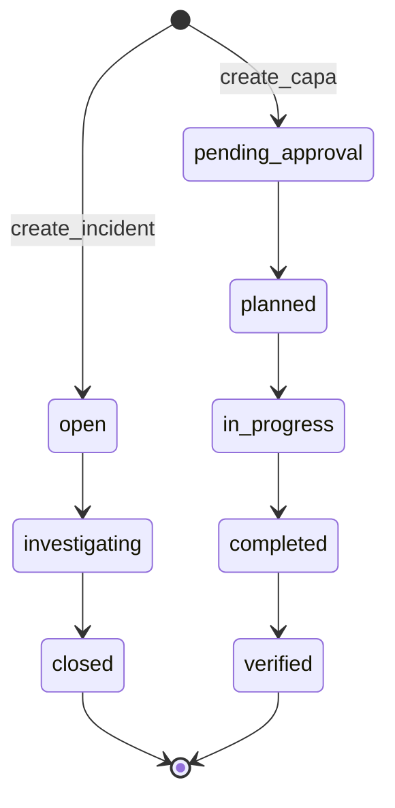

# Workflow depth (beyond “AI wrapper”)

This document maps **deterministic, auditable workflow machinery** in the repository. It supports technical diligence that the platform is **operational software**: state machines, RBAC, transactional audit logs, and retention—not only LLM assists.

**Companion:** [architecture-map.md](./architecture-map.md), [CONTEXT.md](../CONTEXT.md).

---

## 1. Rule engines (pure transition tables)

| Domain | File | Rule shape |
|--------|------|------------|
| Incidents | [`src/lib/workflow/incidentTransitions.ts`](../src/lib/workflow/incidentTransitions.ts) | `allowedIncidentTransition(from, to)` — graph: `open` → `investigating` → `closed`. |
| CAPA | [`src/lib/workflow/capaTransitions.ts`](../src/lib/workflow/capaTransitions.ts) | `allowedCapaTransition(from, to)` — includes `pending_approval` and `verified` terminal state. |

Routers should delegate to these helpers so invalid transitions fail consistently (and tests can cover transition matrices).

---

## 2. Workflow state machines (high level)

**Extension points:** Approval chains, parallel reviews, and escalation tiers are implemented by enriching schema + procedures while **keeping** transition validation explicit (avoid silent status jumps).

---

## 3. Compliance audit logs (transactional)

`writeAuditLog` is invoked from multiple routers when regulated entities change—for example:

- Incidents, CAPA, internal audits / findings  
- CAPA **approval** decisions (`approval` router: submit, step approve/reject, complete)  
- Data retention policy updates  
- Aspects, planning objectives/controls/KPIs, program records  
- Establishment / OSHA regulatory sidecar mutations  
- Integration enqueue smoke path  
- Consultation records  

Search the codebase for `writeAuditLog` under `src/server/trpc/routers/` for the authoritative list as the product grows.

**Immutable evidence:** Rows in `audit_log` are append-oriented; destruction or anonymization is governed by retention jobs and must remain explainable (see [COMPLIANCE.md](../COMPLIANCE.md)).

---

## 4. Enterprise permission model

- Every new procedure that exposes or mutates regulated data should use **`assertPermission`** with a key from **`PERMISSIONS`** ([`src/lib/rbac.ts`](../src/lib/rbac.ts)).
- **Demo read-only:** `DEMO_READ_ONLY` + `DEMO_MODE` blocks tRPC **mutations** in [`src/server/trpc/init.ts`](../src/server/trpc/init.ts) for sandbox demos without weakening production RBAC.

---

## 5. Operational ownership routing

Ownership is modeled in domain tables (e.g. assignee fields, org/site scoping) and enforced through org-scoped inputs (`orgScope` patterns in routers). **Field UX** for “who owns this next” belongs in dashboard flows; server-side, org membership + permission keys gate visibility and edits.

---

## 6. Exception handling & resilience

- **Validation:** Zod at tRPC boundaries; structured AI outputs validated before persistence.
- **Rate limits:** `protectedMutation` / AI-adjacent paths integrate Upstash where configured ([`src/server/ratelimit.ts`](../src/server/ratelimit.ts)); local/dev may no-op when unset.
- **Retries / repair loops:** AI calls can add application-level retries in the gateway layer; **regulated decisions** still require human approval per product policy.

---

## 7. What AI is (and is not)

| AI / RAG | Role |
|----------|------|
| **Is** | Drafting assistance, search over approved corpora, optional seed narrative enrichment. |
| **Is not** | Source of truth for incident/CAPA status, retention clocks, or OSHA recordability without persisted, permissioned mutations. |

This separation is what keeps the stack **procurement-defensible** as assistant features expand.

---

## 8. CAPA plan approvals

See [approval-workflow.md](./approval-workflow.md): `pending_approval` → `planned` requires an **approved** `approval_request`; approvers work from **`/dashboard/approvals`** (permission **`capa:approve`**).
