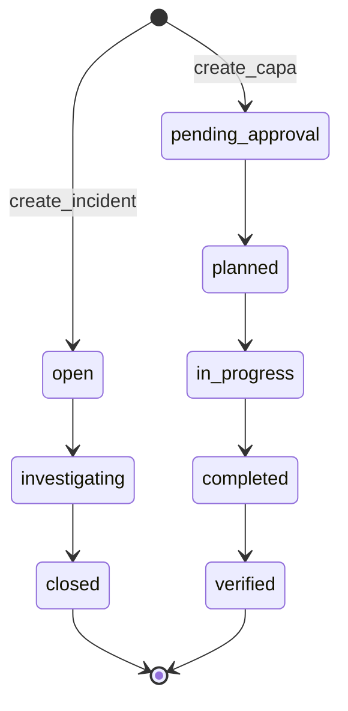

# Workflow depth (beyond “AI wrapper”)

This document maps **deterministic, auditable workflow machinery** in the repository. It supports technical diligence that the platform is **operational software**: state machines, RBAC, transactional audit logs, and retention—not only LLM assists.

**Companion:** [architecture-map.md](./architecture-map.md), [CONTEXT.md](../CONTEXT.md).

**QA:** [Staging & desk-to-field UAT](./qa/staging-uat-desk-to-field.md); [`writeAuditLog`](../src/server/services/audit.ts) router inventory: [mutation auditability matrix](./qa/mutation-auditability-matrix.md).

---

## 1. Rule engines (pure transition tables)

| Domain | File | Rule shape |
|--------|------|------------|
| Incidents | [`src/lib/workflow/incidentTransitions.ts`](../src/lib/workflow/incidentTransitions.ts) | `allowedIncidentTransition(from, to)` — graph: `open` → `investigating` → `closed`. **Admin:** `allowedIncidentAdminReopen` allows `closed` → `investigating` with `org:admin` + `reopenJustification` (see [`incident.updateStatus`](../src/server/trpc/routers/incident.ts)). |
| CAPA | [`src/lib/workflow/capaTransitions.ts`](../src/lib/workflow/capaTransitions.ts) | `allowedCapaTransition(from, to)` — includes `pending_approval` and `verified` terminal state. |
| Inspections | [`src/lib/workflow/inspectionTransitions.ts`](../src/lib/workflow/inspectionTransitions.ts) | `allowedInspectionTransition` — `scheduled` → `in_progress` → `completed` or `cancelled`. |

Routers should delegate to these helpers so invalid transitions fail consistently (and tests can cover transition matrices).

---

## 2. Workflow state machines (high level)

**Extension points:** Approval chains, parallel reviews, and escalation tiers are implemented by enriching schema + procedures while **keeping** transition validation explicit (avoid silent status jumps).

---

## 3. Compliance audit logs (transactional)

`writeAuditLog` is invoked from multiple routers when regulated entities change—for example:

- Incidents, CAPA, internal audits / findings  
- CAPA **approval** decisions (`approval` router: submit, step approve/reject, complete)  
- Data retention policy updates  
- Aspects, planning objectives/controls/KPIs, program records  
- Establishment / OSHA regulatory sidecar mutations  
- Integration enqueue smoke path  
- Consultation records  
- **Risk assessments** (`planning.risk.*`) and **environmental regulatory permits** (`environmentalRegulatoryPermit.*`), including JSA steps and permit conditions  

Search the codebase for `writeAuditLog` under `src/server/trpc/routers/` for the authoritative list as the product grows (maintained checklist: [mutation-auditability-matrix.md](./qa/mutation-auditability-matrix.md)).

**Command center (supervisor snapshot):** [`analytics.commandCenter`](../src/server/trpc/routers/analytics.ts) adds permission-scoped KPIs for overdue risk `review_due_at` and environmental permits inside a 30-day expiry window, plus recent activity feed rows for those domains.

**Immutable evidence:** Rows in `audit_log` are append-oriented; destruction or anonymization is governed by retention jobs and must remain explainable (see [COMPLIANCE.md](../COMPLIANCE.md)).

---

## 4. Enterprise permission model

- Every new procedure that exposes or mutates regulated data should use **`assertPermission`** with a key from **`PERMISSIONS`** ([`src/lib/rbac.ts`](../src/lib/rbac.ts)).
- **Demo read-only:** `DEMO_READ_ONLY` + `DEMO_MODE` blocks tRPC **mutations** in [`src/server/trpc/init.ts`](../src/server/trpc/init.ts) for sandbox demos without weakening production RBAC.

---

## 5. Operational ownership routing

Ownership is modeled in domain tables (e.g. assignee fields, org/site scoping) and enforced through org-scoped inputs (`orgScope` patterns in routers). **Field UX** for “who owns this next” is implemented via **`tasks.actionQueue`** ([`actionQueueQuery.ts`](../src/server/services/tasks/actionQueueQuery.ts), ranking in [`actionQueue.ts`](../src/lib/tasks/actionQueue.ts)) on desk/field home and the task hub — see [action-queue-dashboard-spec.md](./roadmap/action-queue-dashboard-spec.md) (Phase A/B shipped). Command-center attention chips deduplicate user-assigned items already shown in the **Your work** hero ([`filterAttentionChipsForActionQueue`](../src/lib/dashboard/commandCenterSignals.ts)).

---

## 6. Exception handling & resilience

- **Validation:** Zod at tRPC boundaries; structured AI outputs validated before persistence.
- **Rate limits:** `protectedMutation` / AI-adjacent paths integrate Upstash where configured ([`src/server/ratelimit.ts`](../src/server/ratelimit.ts)); local/dev may no-op when unset.
- **Retries / repair loops:** AI calls can add application-level retries in the gateway layer; **regulated decisions** still require human approval per product policy.

---

## 7. What AI is (and is not)

| AI / RAG | Role |
|----------|------|
| **Is** | Drafting assistance, search over approved corpora, optional seed narrative enrichment. |
| **Is not** | Source of truth for incident/CAPA status, retention clocks, or OSHA recordability without persisted, permissioned mutations. |

This separation is what keeps the stack **procurement-defensible** as assistant features expand.

---

## 8. CAPA plan approvals

See [approval-workflow.md](./approval-workflow.md): `pending_approval` → `planned` requires an **approved** `approval_request`; approvers work from **`/dashboard/approvals`** (permission **`capa:approve`**).

---

## 9. Partnership backlog (deterministic spine)

Directions in [ROADMAP.md § Partnership backlog](../ROADMAP.md) extend operational workflows **without** changing the authoritative rule:

- **CAPA and work-permit approvals** remain human-gated [`approval`](./approval-workflow.md) paths; assistants do not approve steps.
- **Observation follow-up / SLA ladders** must use explicit transitions, RBAC, and `audit_log` (or successor patterns) wherever status or ownership moves are introduced—parity with incidents/CAPA auditing expectations.
- **Observation follow-up (implemented):** `safety_observation.assignee_user_id` / `follow_up_due_at` plus overdue cron → `escalation_event` (`entity_type` **`safety_observation`**) — see [`observationFollowUpEscalation.ts`](../src/server/services/observationFollowUpEscalation.ts).
- **Offline / outbox** replay must invoke the **same mutations** online users use so validation, org scope, and audit records stay uniform.
- **Leading-indicator dashboards** augment [`analytics`](../src/server/trpc/routers/analytics.ts) reads only; lifecycle clocks and regulated obligations still flow from persisted domain tables and retention policy—see [COMPLIANCE.md](../COMPLIANCE.md).

---

## 10. Program register: risk & environmental compliance (non-PTW)

| Surface | Router / routes | Notes |
|--------|-----------------|--------|
| Risk roster & editor | [`planning/riskRouter.ts`](../src/server/trpc/routers/planning/riskRouter.ts), `/dashboard/risk-assessments` | `task_based` requires `risk_assessment_step` rows; `site_based` requires `site_id`. |
| Regulatory permit register | [`environmentalRegulatoryPermit.ts`](../src/server/trpc/routers/environmentalRegulatoryPermit.ts), `/dashboard/environmental-permits` | Separate from **`work_permit`** (PTW); optional FK from `environmental_monitoring_result` and `corrective_action`. |

Operational semantics mirror [architecture-map.md § Workflow engine](./architecture-map.md#3-workflow-engine-structure) and [COMPLIANCE.md](../COMPLIANCE.md) (internal register vs agency submissions).
